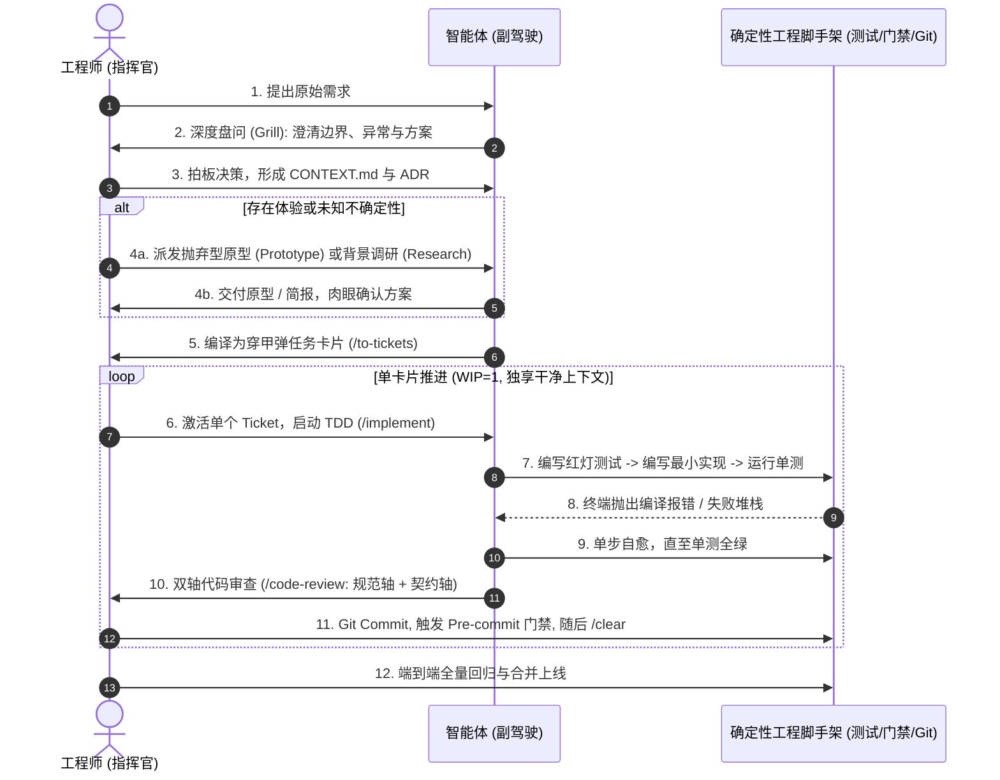

# 《掌握AI编码：真实工程师的实战手册（92集全景深度解构巨著）》
> **课程溯源**：Matt Pocock《AI Coding for Real Engineers》（B站 92 集实战训练营：BV1zMjH6NErd）  
> **核心宗旨**：破除“AI 万能”的盲目崇拜与“AI 全是垃圾”的保守虚无，以真实的计算机科学与严谨软件工程为基石，构筑确定性脚手架，十倍放大工程师的架构与交付效能。

---

## 序言：软件工程范式的代际重构

在生成式 AI 与编码 Agent 爆发的今天，软件工程界正在经历一场深刻的认知撕裂：
1. **盲目崇拜派**：“软件工程师马上要失业了，只要给一句 Prompt，AI 就能在数秒内构建完整系统。”
2. **保守虚无派**：“AI 产生的全是幻觉，写出来的代码全是有毒垃圾，排查 Bug 的时间比手写还长，毫无实用价值。”

**真实资深工程师的视角是：AI 是一辆时速 300 公里的赛车；而人类工程师是离合器、方向盘与刹车系统。**

如果把方向盘完全交给 AI，它必然会以极快的速度冲向悬崖；如果不用 AI，你就会在马车时代被工业时代抛弃。
**当代码生成的边际成本无限趋近于零时，软件工程的核心价值彻底由“打字写语法”转移为“设计不可穿透的工程反馈防线、锻造精准需求与驾驭深模块架构”。**

本手册全面覆盖 Matt Pocock 训练营全部 **92 集视频、6 大实战天数、4 场 Office Hours**，深度解构每一讲的核心工程逻辑、底层物理特性、反模式陷阱与可落地的架构规范。

---

## 92 集课程全景知识地图

```
┌────────────────────────────────────────────────────────────────────────┐
│                        AI Coding for Real Engineers                    │
└───────────────────────────────────┬────────────────────────────────────┘
                                    │
    ┌───────────────────────────────┼───────────────────────────────┐
    ▼                               ▼                               ▼
【基建与终端控制】              【认知基石与物理现实】          【操控方向盘与上下文工程】
001~007: 环境准备与基建         015: LLM 底层采样物理极限       028~030: AGENTS.md 宪法规范
008~010: 终端交互与会话管理     016: Subagents 子代理机制       031: 渐进式揭示三层拓扑
011: Claude 与 IDE 协同        017~020: 代码库探索与首个特性   032~034: Agent Skills SOP 状态机
012: 极速穿越时间 (Undo/Git)    021: 非确定性与复合错误陷阱     035: 自动化持久记忆与 ADR
013~014: 权限边界与安全模型     022: 状态栏 150k 智能区监控
                                023: 为什么 Plan Mode 是灾难
                                024~025: GEC (盘问-执行-清空)
                                026~027: 压缩与交接 (Handoff)
    │                               │                               │
    ├───────────────────────────────┼───────────────────────────────┤
    ▼                               ▼                               ▼
【高维规划与任务拆解】          【工程反馈环与代码防腐】        【AFK 离线无人值守系统】
036: 攻坚超大规模任务           049: 廉价代码引发的维护危机     059: 什么是 AFK Agent
037~038: 反向盘问 (Grill) PRD   050~054: 紧致反馈环 (<3秒)       060: Sandcastle 机制
039~040: 多阶段多窗口规划       055: Pre-commit 物理关卡        061~062: HITL Agent 实战演练
041~043: 穿甲弹 vs 抛弃型原型   056~058: TDD 在 AI 时代的涅槃   063: Worktree 沙盒隔离
044~045: 穿甲弹多阶段计划执行   (杜绝 AI 自写自测假绿灯)        064~065: AFK 离线闭环体验
046: 结构化多选提问艺术                                         066~070: GitHub Issues 任务队列
047~048: 办公室答疑 (Office 1)
    │                               │                               │
    └───────────────────────────────┼───────────────────────────────┘
                                    ▼
                     【人在回路终极人机协同 (HITL)】
                     071: HITL 与 AFK 任务分流矩阵
                     072~074: 拒绝僵化计划：看板流思维 (Kanban)
                     075~077: 异步背景调研 (Research Skill)
                     078~081: 抛弃型原型 (Prototype Skill: Logic & UI)
                     082~085: 打造 AI 喜爱的“深模块架构” (Deep Modules)
                     086: 终极工程实战全流程 (The Final Workflow)
                     087~088: 附录：绿地项目初始化与 grill-with-docs
                     089~092: 终极 Office Hours 答疑 (巨石改造/竞态)
```

---

# 第一部分：环境基建与终端控制（P1 ~ P14）

### P1 ~ P7：课前准备、环境工程化与数据库迁移纪律
* **P1（Where We're Going）**：课程目标不是教你如何写“提示词小技巧”，而是教会你如何像 CTO 和主任架构师一样，搭建一整套约束与操控 Agent 的工程操作系统。
* **P3 ~ P4（Repo Setup & DB Migrations）**：
  * **确定性环境先行**：在让 AI 进入代码库前，本地必须拥有确定性的构建流水线和数据库迁移机制；
  * **数据库迁移绝对纪律**：严禁让 AI 随意直连生产数据库执行原始 SQL，所有结构变更必须通过受版本控制的迁移脚本（Migration Files）落地，且必须具备回滚断言。
* **P5 ~ P7（Claude Code Setup & Office Hours 机制）**：配置高性能开发终端，确立提问前“先查本地事实、不猜想”的准则。

### P8 ~ P10：终端提示词工程与会话管理
* **为什么终端（CLI）远胜于 IDE 插件？**
  * IDE 侧边栏插件往往将整个工作区的状态、打开的数百个 Tab、甚至调试器的内存快照未经修剪直接塞入 Prompt，导致上下文瞬间污染；
  * **CLI Agent（如 Claude Code / Antigravity）直接与宿主系统的 Shell 交互**，拥有执行真实构建、运行测试、过滤输出的完全能力，具备真正的操作系统级手脚。
* **P9 ~ P10（Session Management & Prompting in Terminal）**：
  * 终端提示词必须以**动词+明确目标+约束范围**开头（如：`Run vitest on src/auth and fix the null pointer exception without touching the schema`）；
  * 保持单次会话只解决单一垂直切片，不要在一个会话中发散讨论 10 个无关问题。

### P11：Claude 与 IDE 的双轨协同心智
* **心智模型**：**终端是 AI 的执行引擎，IDE 是人类的观察透镜**。
* 人类在 VSCode / WebStorm 中高亮查看 Git Diff、观察断点与代码树；AI 在终端中全速运行构建与自愈。
* 保持编辑器打开的文件与终端焦点保持一致，使工具能够自动感知当前活动文档（Active Document Context）。

### P12：极速穿越时间：逆转撤销（Undo）与 Git 硬联动
* **致命反模式**：当 AI 改坏了一段代码，很多新手会在聊天框里打字：“你刚才改错了，请帮我改回 5 分钟前的样子。”
  * **代价**：浪费成千上万的上下文 Token；AI 凭借模糊的记忆去“复原”，经常引入二次污染与新的笔误。
* **Matt 的黄金法则**：
  * 善用 Claude Code 的 `/undo` 指令进行单步指令级回退；
  * 面对大面积代码改动，直接运行 `git checkout -- <file>` 或 `git restore .` 进行物理级精准还原！**永远不要用自然语言求 AI 撤销，用操作系统命令物理还原。**

### P13 ~ P14：权限边界与安全模型（Permissions）
* **只读操作全自动（Auto-Approve）**：
  * 文件读取（`view_file`）、目录列出（`list_dir`）、文本搜索（`grep`）一律放行，不打断思考流；
* **幂等执行无感化**：单测运行、Lint 检查、类型检查允许高频执行；
* **破坏性指令死门禁（Hard Blocking）**：
  * 严禁放行危险命令：`git push -f`、`git reset --hard`、`rm -rf /`、未经确认的 `DROP TABLE`；
  * 必须配置安全 Hook，任何破坏性操作必须在终端弹出显式的人工二次确认。

---

# 第二部分：物理现实与认知基石（Day 1: P15 ~ P27）

### P15：采样器本质与三大物理极限（The Constraints of LLMs）
Matt Pocock 在 P15 中给出了全套方法论的立论之本：**工程师对 AI 产生挫败感的唯一原因，就是对 LLM 的底层物理特性抱有不切实际的拟人化幻想。**

```
                     LLM 的客观物理本质
        ┌─────────────────────────────────────────┐
        │  高维条件概率文本采样器 (Next-Token Sampler) │
        └────────────────────┬────────────────────┘
                             │
            ┌────────────────┴────────────────┐
            ▼                                 ▼
   【长得像正确答案】                  【软性退化而非硬崩溃】
   在统计学上极具专业美感              超载时不抛 OutOfMemory，
   但在真实机器中可能编译即崩          转为极端阿谀奉承与删除边界
```

1. **“长得像专业代码” ≠ “在机器里能跑通”**：
   * LLM 没有真正的 CPU/运行时环境，它根据上下文统计概率续写代码；
   * 当库的 API 发生重大 Breaking Change 时，如果训练集里旧版本占 90%，它会以 100% 极具说服力的语气写出根本不存在或已弃用的语法。
2. **中间迷失（Lost in the Middle）**：
   * Transformer 架构自注意力机制的权重高度集中在**头部（System Prompt）**与**尾部（最近几轮对话）**；
   * 随着上下文拉长，位于中段的架构约束、类型契约与边界说明会被物理稀释，模型会彻底对其“视而不见”。
3. **软性退化（Silent Degradation）**：
   * 传统软件内存超载会崩溃（Hard Crash），LLM 发生退化时表现为**阿谀奉承（Sycophancy）**——无论你提出多么荒谬的代码，它都会谄媚地回答：“您说得完全正确！”，同时在生成的代码中偷偷把复杂的错误处理全部抹掉。

### P16：Subagents（子代理机制）
* **定义**：从主 Agent 派发出的临时独立智能体，执行特定专项任务（如纯调研、临时测试探索）。
* **核心价值**：**上下文防火墙（Context Firewall）**。
  * 子代理读取了上万行无关代码后，只将最终结论（几十行 Markdown 报告）提炼给主 Agent；
  * 主 Agent 的上下文空间得到绝对保护，彻底阻断注意力污染。

### P17 ~ P20：代码库探索与首个功能实战
* 在接手陌生代码库时，不要让 AI 盲目全盘扫描；
* 指导 AI 优先检索：构建脚本（`package.json` / `Cargo.toml`）、核心入口（`index.ts` / `main.rs`）与测试套件目录，快速建立系统的“骨架地图”。

### P21：非确定性与致命的复合错误陷阱（Non-Determinism & Compounding Errors）
* **为什么 Temperature = 0 依然存在非确定性？**
  * GPU 浮点运算在高度并行执行时，浮点加法的结合律并不严格成立，细微的数值微扰足以让某些临界 Token 的概率排序发生微量颠倒；首字一旦微调，后续所有自回归生成就会走向不同分支。
* **复合错误数学定律（Compounding Errors）**：
  > 假定 Agent 每一小步操作（找准文件、读懂逻辑、无错修改、不引入破坏）的成功率高达 **90%**：
  > * 执行 1 步：$0.9^1 = 90\%$
  > * 连续执行 5 步：$0.9^5 \approx 59.0\%$
  > * 连续执行 10 步：$0.9^{10} \approx 34.8\%$
  > * 连续执行 20 步：$0.9^{20} \approx 12.1\%$！
* **工程启示**：让 AI 脱离人工监管与自动化测试，连续执行 10 步以上的大任务，翻车概率高达 **65% 以上**！

### P22：状态栏 150k “智能区”（Smart Zone）法则
* **150k 是注意力物理警戒线**：
  * 在 0 ~ 150k Token 区间，顶级模型保持极高的逻辑敏锐度；
  * 一旦超过 150k，幻觉与重复代码发生率呈指数级上升。
* **纪律**：终端状态栏必须显式打印当前 Token 占用量，一旦接近 150k，必须立即交接并清空会话。

### P23：为什么官方默认的 Plan Mode 是场灾难？（Why Plan Mode Sucks）
* **三大死穴**：
  1. **闭门造车（Un-grounded）**：在没有真实探索当前代码实际依赖前，凭空列出 20 个大步骤；
  2. **级联崩溃（Cascading Failure）**：第 2 步在实操中遇到不可预见的类型冲突，后续 18 个步骤全部作废；
  3. **虚假报告（Performative Success）**：步骤列表过长，模型在执行到第 15 步时产生幻觉，自我报告“已完成全部待办”，实则代码千疮百孔。

### P24 ~ P25：GEC 极简微循环（The Grill-Execute-Clear Loop）
攻坚任何单点特性的最小原子工作流：


1. **Grill（盘问）**：在动手敲代码前，就入参、出参、边界异常与向后兼容对人类进行严厉盘问；
2. **Execute（执行）**：在极短的上下文内，只围绕变绿单个测试编写最小生产代码；
3. **Clear（清空）**：验证通过并 Git Commit 后，**无情执行 `/clear`**，彻底将思维废气清零！

### P26 ~ P27：上下文压缩（Compaction）与跨阶段交接（Handing Off）
* 当一个大阶段结束、不得不开启新窗口时，使用 `/handoff` 技能将关键决策、当前达成的状态模型、已通过的测试清单打包为一个结构化 Markdown 文件；
* 新会话以此 Markdown 文件作为种子冷启动，实现无损跨窗口交接。

---

# 第三部分：操控系统的方向盘（Day 2: P28 ~ P35）

### P28 ~ P30：`AGENTS.md`：仓库根目录下的“宪法与指针索引”
很多团队把几万字的系统规范强塞进全局提示词，结果 AI 频繁视而不见。
`AGENTS.md`（或 `CLAUDE.md`）是受 Git 版本控制的**单一事实来源（Single Source of Truth）**。

#### 优质 `AGENTS.md` 的三大黄金定律 (The Three Golden Invariants)
1. **短小克制（Be Brief）**：严格控制在 **100 ~ 150 行以内**，防止稀释注意力；
2. **绝对否定性（Be Negative）**：告诉 AI“严禁做什么”（负向约束在概率采样中最能阻断幻觉分支）：
   * ❌ 弱约束：“建议编写 TypeScript 代码，尽量不要使用 any。”
   * ✅ 死门禁：“【死门禁】全库严禁新建任何 `.js` 脚本！遇到遗留 JS 必须就地重构为 TS。严禁使用 any，违者编译直接报错！”
3. **确定性可验证（Be Verifiable）**：每条规则必须对应一条 CLI 检验命令（如 `npm run test:gate`）。无法被计算机命令自动检验的规则等于废话。

### P31：渐进式揭示（Progressive Disclosure）：三层记忆拓扑架构
人类大脑从不把整个百科全书载入内存才开始工作；而是先看目录索引，按需翻阅具体章节。

```
┌────────────────────────────────────────────────────────┐
│  Tier 1: 顶层宪法层 (Root AGENTS.md / CONTEXT.md)       │
│  - 永远常驻，极度精炼 (< 150 行)                         │
│  - 核心宪法死门禁 + 指针目录表 (Directory of Pointers)  │
└──────────────────────────┬─────────────────────────────┘
                           │ 按需指向具体子系统
                           ▼
┌────────────────────────────────────────────────────────┐
│  Tier 2: 领域按需层 (Sub-References / Module README)   │
│  - 例如: references/anti-patterns.md, references/ui.md │
│  - 仅在 Agent 触碰具体模块时，由其动态按需加载          │
└──────────────────────────┬─────────────────────────────┘
                           │ 触发特定工程动作
                           ▼
┌────────────────────────────────────────────────────────┐
│  Tier 3: 运行时动态技能 (Runtime Agent Skills)         │
│  - 例如: /tdd, /grill-with-docs, /code-review          │
│  - 仅在执行具体工序时临时装载，步骤完成后随会话清空     │
└────────────────────────────────────────────────────────┘
```

### P32 ~ P34：Agent Skills 体系：将团队工程 SOP 编译为状态机
Skill 不是随意的提示词模板，而是**把高工的专业工作流程（SOP）编译成具备严格输入、执行流与出口断言的状态机指令集**。

#### 工业级 Skill 的核心构成规范
1. **YAML Frontmatter 元数据**：
   * `name`: 技能标识；
   * `description`: 明确声明触发场景，**并明确声明何时严禁触发（反误触机制）**；
2. **严格的顺序流程（Sequential Workflow）**：
   * 不可跳步的执行流（Step 1 探测现状 ➔ Step 2 提炼方案 ➔ Step 3 用户拍板 ➔ Step 4 代码落地）；
3. **确定性出口准则（Exit Criteria）**：
   * 明确何为“完成”，必须执行哪些自检命令，严禁口头汇报完毕。

### P35：自动化持久记忆与架构决策记录（Automatic Memory & ADR）
* **经验代码化**：如果 Agent 发现“某个 Windows 命令在 PowerShell 下必须加双引号”，不要只在聊天里说一声，必须立即将这个经验固化在项目的配置、脚本或 `AGENTS.md` 中；
* **架构决策记录（ADR）**：面对重大技术选型或架构两难（如“为什么选用 Canvas 而不是 SVG”），沉淀为 `docs/adr/NNNN-xxx.md`，使新 Agent 能瞬间继承历史脉络。

---

# 第四部分：高维规划与任务拆解工程（Day 3: P36 ~ P48）

### P36 ~ P38：巨型任务应对与反向盘问（Grilling）锻造 PRD
面对模糊复杂的巨型需求，资深工程师的第一步永远是**反向盘问（Grilling）**：

#### `grilling` 技能的内部算法机制
1. **构建设计决策树（Design Tree）**：每个决策都会衍生出下级分支决策；
2. **计算决策前沿（The Frontier）**：当前前置条件已被满足、可以立即向人类提问的所有问题；
3. **严禁越界找事实**：“找事实是 Agent 的事，做决策才是人类的事”。凡是能通过查文件、搜代码找到的信息，Agent 必须派子代理自行查明，严禁拿已知事实骚扰人类。

### P39 ~ P40：跨上下文窗口的多阶段规划（Multi-Phase Plans）
大功能必须切片为可独立交接的阶段（Phases）：
* **Phase 1（穿甲弹）**：搭建极简骨架，验证端到端连通性 ➔ Commit ➔ `/clear`；
* **Phase 2（状态核心）**：在新窗口加载 Phase 1 产物，TDD 红绿循环实现主算法 ➔ Commit ➔ `/clear`；
* **Phase 3（边界分支）**：覆盖空值、极端规模与防御逻辑 ➔ Commit ➔ `/clear`；
* **Phase 4（表现层验收）**：视口核查与响应式布局对齐 ➔ 归档。

### P41 ~ P43：穿甲弹技术（Tracer Bullets）vs 抛弃型原型（Prototype）
这是 Matt Pocock 训练营中最具辨析度的核心概念之一：

| 评估维度 | 🚀 穿甲弹（Tracer Bullets） | 🧪 抛弃型原型（Prototype） |
| :--- | :--- | :--- |
| **首要使命** | **垂直刺穿全部分层，验证架构接缝与连通性** | **快速探索未知手感、视觉样式或推翻算法假设** |
| **代码品质** | **生产级代码（Production Quality）**<br/>严密类型检查、错误分支、自动化测试保护 | **粗糙拼凑（Quick & Dirty Hack）**<br/>无测试、无复杂抽象，允许硬编码与写死参数 |
| **生命周期** | **永久留存（Keep Forever）**<br/>系统的第一块基石，后续功能依附其生长 | **用完即扔（Throwaway）**<br/>一旦获得肉眼或心理结论，**立即物理删除** |
| **代码去向** | 提交至主开发分支，合入主干 | 放在临时分支或独立 scratch 目录，**严禁合入主干** |
| **典型案例** | 前端点击 ➔ 触发后端 RPC ➔ 写入 DB，全通 | 10秒肉眼看看：这个抽屉菜单展开是折叠顺手还是悬浮顺手？ |

> [!CAUTION]
> **严厉铁律**：**永远不要把原型的脏代码重构成生产代码！**  
> 原型的价值在于它产生的“认知收获”（Insights）。一旦获得了结论，立刻用生产级的 TDD 流程从白纸重新构建。

### P44 ~ P45：宽重构的特例：Expand-Contract（展开-收缩）模式
在 `to-tickets` 中，普通功能切为穿甲弹垂直切片；但**涉及全库大范围修改的宽重构（Wide Refactors）**（如修改共享核心接口）严禁做单片垂直切割，必须采用展开-收缩模式：
1. **Expand（展开）**：新增一套新接口，保留旧接口，两者并存，全库编译保持绿灯；
2. **Migrate（批量迁移）**：按目录分批迁移调用方，逐个批次提交，保证每次 Commit 都是绿的；
3. **Contract（收缩）**：当旧接口的所有调用方清零后，在一个独立的 Ticket 中物理删除旧接口。

### P46：提问的艺术：结构化多选收敛（Ask User Question）
向人类提问时，严禁提出“你怎么看”这种开放式难题；必须提供低认知负荷的结构化选项：
```
❓ Q1 - 状态空间渲染方案选型:
1. (Recommended) 接入统一的 GridUniquePathsCompiler: 复用成熟的二维网格顺逆推演化, 增量代码 <50 行
2. 新建专用 Strategy 独立渲染: 拥有自定义对角线动画, 但需额外编写 300+ 行步骤生成器
➡️ 推荐方案 1
```

---

# 第五部分：工程反馈环与代码防腐（Day 4: P49 ~ P58）

### P49：廉价代码危机（Is Code Cheap?）
在传统时代写代码是昂贵的；在 AI 时代，生成代码的边际成本趋近于零。
**生成极其廉价，而审查与维护极其昂贵。** 如果没有坚不可摧的工程反馈防线，代码库将在几天内积聚成山一般的技术债务。

### P50 ~ P54：紧致反馈环（Tight Feedback Loops）
* **反馈延迟（Feedback Latency）决定一切**：
  * 反馈延迟 > 5 分钟（人工打包、点浏览器、截图给 AI）：人类筋疲力尽，AI 丢失上下文；
  * 反馈延迟 < 3 秒（单一命令、瞬间打印红灯堆栈）：AI 能在单步内精准自我修复。
* **唯一验证契约**：判定只认 Exit Code（0 为绿，非 0 为红），拒绝人类肉眼主观猜测。

### P56 ~ P58：TDD 在 AI 时代的涅槃与防自测陷阱（Red-Green-Refactor）
很多开发者最容易踩的陷阱：**“让 AI 既写功能代码，又写单元测试。”**

#### 为什么 AI 自写自测必翻车？（The Self-Confirmation Trap）
* 如果 AI 漏掉了边界条件，它在写测试时就会**围绕自身写出的错误实现去写假断言**；
* 结果是终端 100% 绿灯，但在真实生产环境中直接爆炸！

#### 黄金协同范式：人类定契约，AI 做实现
```
人类工程师 (架构裁判)                     AI 智能体 (副驾驶执行器)
┌─────────────────────────┐               ┌─────────────────────────┐
│ 1. 编写红灯测试 (RED)    │               │                         │
│ 明确断言预期输入输出与边界 │ ─────────────►│                         │
│ 运行测试: 确认必然红灯    │               │ 2. 编写最小生产代码(GREEN)│
│                         │               │ 严禁修改测试文件, 只写使  │
│                         │◄───────────── │ 测试变绿的最简实现代码    │
│ 3. 验收绿灯与审查重构   │               │                         │
└─────────────────────────┘               └─────────────────────────┘
```

#### 乒乓 TDD（Ping-Pong TDD）四步流
1. **穿甲断言（Sanity Assertion）**：断言模块存在，空输入返回默认值（15秒变绿）；
2. **常规断言（Happy Path）**：断言标准输入输出，主干跑通（30秒变绿）；
3. **防御断言（Edge Cases）**：断言空指针、越界、环路、并发竞争（30秒自愈）；
4. **结构重构（Refactoring）**：全套单测保护下解耦模块，提取共享编译器。

### P55：Pre-Commit 物理铁笼
* 通过 Husky / Lint-staged，在敲击 `git commit` 的瞬间自动触发核心门禁；
* 门禁检测到卡片重复、标题脑裂、一维槽位受污染或单测红灯时，直接熔断并拒绝提交。

---

# 第六部分：AFK 离线无人值守系统（Day 5: P59 ~ P70）

### P59：AFK Agent 的定义与准入四要素
**AFK（Away-From-Keyboard）**：人类离开电脑（休息、开会、睡眠）期间，系统自动运行的 Agent。

#### AFK 准入四要素（缺一不可，否则严禁放行）
1. **输入 100% 明确**：Issue 描述包含详尽的现状与预期，无歧义；
2. **上下文完全隔离**：不依赖未提交的脏会话或未理清的口头约定；
3. **确定性测试作为裁判**：有现成的测试套件能客观判定成功与否；
4. **爆炸半径极小（Small Blast Radius）**：任务只触及单点文件，绝不波及系统核心共享协议。

### P60 ~ P63：沙盒隔离（Sandcastle / Sandboxing）
* **Git Worktree 隔离**：每个 AFK 任务在独立的本地目录运行，即使改崩，主工作区毫发无损；
* **防测试篡改机制**：CI 或 Pre-commit 强制对比测试文件的 Git Diff，若发现 AI 偷偷删除测试断言以迎合绿灯，立即标记致命错误并熔断回滚。

### P66 ~ P70：基于 GitHub Issues 的自动化流水线
```
人类工程师 ──► 创建 Issue (打上 "ready-for-agent" 标签)
                     │
                     ▼
            AFK 自动化调度脚本
                     │
                     ├─► 1. 创建独立 Git Worktree
                     ├─► 2. 灌入 Issue 描述与干净上下文
                     ├─► 3. 执行 TDD 红绿循环与自愈
                     ├─► 4. 触发 Pre-commit 门禁
                     └─► 5. 自动推送并创建 Pull Request
                                  │
                                  ▼
人类早上上班 ──► 仅看 Git Diff 与 CI 状态 ──► 绿灯一键 Merge
```

---

# 第七部分：人在回路终极人机协同（Day 6: P71 ~ P88）

### P71：HITL 与 AFK 任务分流矩阵（第 71 集核心精义）
绝不能盲目把所有工作都推给无人值守。资深工程师必须建立清晰的分流本能：

```
                              任务分流决策树
                                    │
               ┌────────────────────┴────────────────────┐
               ▼ 涉及 UI 视觉 / 手感 / 架构重构           ▼ 纯底层逻辑 / 单点 Bug / 数据转换
       【🔴 必须 HITL 人在回路】                   【🟢 允许投入 AFK 离线流水线】
       • 人类在场实时定夺                          • 输入明确, 单测守门
       • 抛弃型原型探索                            • Worktree 隔离运行
       • 看板流动态微调                            • 产出 PR 待晨检
```

### P72 ~ P74：拒绝僵化长计划：看板流思维（Don't Plan, Kanban）
* **在制品限制（WIP = 1）**：同一时间只让 Agent 聚焦于 1 张卡片；
* **动态自适应**：完成上一张卡片后，人类根据真实代码产物重新评估现状，动态增删后续卡片，彻底消灭瀑布式计划的级联失真。

### P75 ~ P77：异步背景调研（Research Skill）
遇到陌生第三方库或前沿 API 时，不要主线程停摆瞎猜：
* 唤起后台子代理（Background Agent）深入阅读官方文档、一手源码与 RFC 规范；
* 产出引用了官方信源的 Markdown 调研简报；
* 人类扫读两分钟，拍板技术路线。

### P78 ~ P81：抛弃型原型设计（Prototype Skill）
面对不确定的设计，文字讨论成本极高，直接唤起原型：
* **分支 A（Logic 逻辑原型）**：单文件 HTML，带按钮与状态展示器，由人类肉眼验证状态机；
* **分支 B（UI 视觉原型）**：单路由多变体，通过底部浮动栏快速切换样式；
* **铁律**：**原型是探路针，验证结论得出后立即物理删除，严禁将原型的脏代码带入生产分支！**

### P82 ~ P85：打造 AI 喜爱的“深模块架构”（Designing Codebases AI Loves）
斯坦福大学 John Ousterhout 教授在《软件设计的哲学》中提出的**深模块（Deep Modules）**理论，是 AI 编程时代的最高架构哲学：

```
       ❌ 浅模块 (Shallow Modules)                 ✅ 深模块 (Deep Modules)
          —— AI 的噩梦，极易破坏                      —— AI 最爱，稳如泰山

     ┌────────────────────────────┐               ┌───────────────────┐
     │  巨大的对外接口 (Interface)  │               │ 窄窄的对外接口 (薄) │
     └──────────────┬─────────────┘               └─────────┬─────────┘
                    │                                       │
     ┌──────────────┴─────────────┐               ┌─────────┴─────────┐
     │    单薄的内部实现 (薄)      │               │                   │
     └────────────────────────────┘               │                   │
                                                  │   极其深厚充实的    │
    • 改一处导致调用方几十处报错                    │   内部隐藏实现    │
    • AI 无法在局部自由发挥                       │   (Deep Implementation)
    • 强耦合，容易引发雪崩                        │                   │
                                                  └───────────────────┘
                                                  • 内部重构对外界零感知
                                                  • AI 只需专注攻坚内部单点
```

#### 深模块核心准则
1. **极窄接口（Narrow Interface）**：暴露的函数越少、入参越简单，AI 越不可能用错；
2. **极深实现（Deep Implementation）**：容错、降级、复杂边界都在模块内部自行消化；
3. **删除测试（The Deletion Test）**：如果删除一个模块只是把复杂度平移到调用方，它就是浅模块；如果删除它会导致大量复杂度在外部爆发，说明它切实承担了封装责任。

### P86：终极工程实战全流程（The Final Workflow）
将全套方法论串联为不可摧毁的交付流水线：



---

# 第八部分：Office Hours 深度答疑精萃（P47, P48, P89 ~ P92）

### 1. 面对巨石老旧系统（Legacy Monolith）如何用 AI 改造？
* **绞杀者模式（Strangler Fig Pattern）**：严禁让 AI 大面积重写老系统；
* 围绕最痛的一个业务点，在其外围建立一层类型安全的 Seam（接缝），向内封装为深模块，写满单测；老系统逐渐被新深模块替换，系统在整个过程中始终保持可运行。

### 2. 多 Agent 并行协作的防竞态法则
* 绝对禁止多个 Agent 在同一上下文窗口或同一工作目录混战；
* **文件系统与 Git 分支是唯一的安全协调介质**。每个 Agent 拥有独立的 Worktree，彼此只通过 PR 和 Issue 进行异步通信。

### 3. 为什么“架构能力”成了工程师最核心的护城河？
* AI 抹平了纯语法的编写壁垒；
* **能否把一个庞大需求切成彼此解耦的穿甲弹卡片、能否设计出窄接口深实现的模块、能否构筑出让 AI 无法作弊的测试门禁，构成了顶级工程师与普通码农的绝对分水岭。**

---

# 附录：Matt Pocock 官方工程技能速查字典

| 技能指令 | 核心职责 | 调用时机与禁忌 |
| :--- | :--- | :--- |
| **`/grill-with-docs`** | 深度反向盘问，同步产出 `CONTEXT.md` 与 ADR | 任何复杂需求动手前必调；严禁不经思考直接写代码 |
| **`/grilling`** | 交互式设计决策树遍历，计算提问前沿（Frontier） | 方案选型与歧义澄清 |
| **`/codebase-design`** | 深模块设计词汇与测试性重构原则 | 接口设计、解耦浅模块、寻找接缝（Seam） |
| **`/improve-codebase-architecture`** | 扫描代码库浅模块摩擦点，输出可视化 HTML 报告 | 架构维护与技术债务消除 |
| **`/prototype`** | 构建可抛弃型原型（Logic 状态机 / UI 样式） | 拿不准人机交互手感或状态机设计时；**验证后必须物理删除** |
| **`/research`** | 派发后台子代理查阅权威一手文档并产出简报 | 遭遇未知第三方库或冷门 API 时 |
| **`/to-tickets`** | 将规格拆解为带有阻断依赖的穿甲弹卡片集 | 准备进入实现阶段前；宽重构使用展开-收缩模式 |
| **`/implement`** | 核心实现驱动器，内联 TDD 红绿循环与代码自愈 | 认领单个卡片写真实生产代码 |
| **`/code-review`** | 针对 Git Diff 进行规范轴与契约轴双重审查 | Commit 或创建 Pull Request 前 |
| **`/setup-matt-pocock-skills`** | 为当前代码库自动化初始化 Issue 跟踪器与领域手册配置 | 新项目首次接入技能体系时 |
| **`/handoff`** | 将当前会话的核心成果打包为结构化 Markdown | 跨目录切换、会话到达 150k 上限需换新窗口时 |
| **`/clear`** | 物理清空当前上下文窗口 | 完成一个 Ticket 并 Commit 后，必须无情清空 |

---

### 结语

真正的软件工程，其终极价值从来不是“打字的速度”，而是**“在混沌中建立秩序的能力”**。  
掌握了这套以 **物理现实认知、上下文克制、紧致反馈环、人在回路精准分流与深模块防腐** 为支柱的现代工程方法论，你不再是被 AI 浪潮裹挟的码农，而是驾驭 AI 军团攻城略地的真正总架构师。
