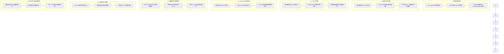

# 🛡️ 商业化安全授权与防逆向部署操作手册
> **适用系统**：Algorithm Visualization Desktop Standalone (Tauri 2 + Vite + TypeScript)  
> **文档版本**：v1.0.0 (生产发布基线)  
> **保密级别**：商业机密 (Confidential)

---

## 目录
1. [系统概述与七层防御矩阵](#一系统概述与七层防御矩阵)
2. [日常商业化运营 SOP（发号与激活）](#二日常商业化运营-sop发号与激活)
3. [盗版溯源与司法取证 SOP（盲水印反查）](#三盗版溯源与司法取证-sop盲水印反查)
4. [核心攻防机制与底层技术实现](#四核心攻防机制与底层技术实现)
5. [生产打包加固与发布流水线](#五生产打包加固与发布流水线)
6. [质量保障与自动化测试门禁速查](#六质量保障与自动化测试门禁速查)

---

## 一、系统概述与七层防御矩阵

为彻底防范客户端被反编译、破解者非法分发、盗版者通过购买正版批量抓取核心算法资产，以及 AI 辅助逆向分析，本项目摒弃了“前端纯布尔值跳转拦截”的脆弱设计，收敛全部安全命脉至 Tauri 原生底层与深模块架构，建立了**七层立体纵深防御体系**：



---

## 二、日常商业化运营 SOP（发号与激活）

### 2.1 买家激活全流程体验
1. **买家获取机器码**：
   - 首次启动未激活软件时，客户端弹出深色玻璃拟态【软件激活】窗口；
   - 界面清晰展示该电脑的专属设备码（格式：`XXXX-XXXX-XXXX-XXXX`，如 `A3F8-9B2C-1E4D-7A0F`）；
   - 买家点击【复制机器码】发送给运营或客服人员。
2. **运营生成授权码**：
   - 运营人员使用离线授权 CLI 签发授权码，回传给买家。
3. **买家激活**：
   - 买家将授权码粘贴至输入框，点击【立即激活】；
   - 系统毫秒级完成 Ed25519 验签与持久化，自动解锁全部算法推演主界面，标题栏点亮“终身授权”或到期日徽章。

### 2.2 离线发号命令行指令速查 (`npm run license:gen`)

所有授权码均通过非对称数字签名离线派生，**无需架设任何中心化验证服务器**，支持完全无网离线激活。

#### 场景 1：为买家签发【永久授权码】（最常用）
```bash
npm run license:gen -- --buyer "buyer_zhangsan_2026" --machine "A3F8-9B2C-1E4D-7A0F"
```
- **输出示例**：
  ```
  ✅ 授权码生成成功！
  买家标识: buyer_zhangsan_2026
  绑定设备: A3F8-9B2C-1E4D-7A0F
  授权期限: 永久有效
  ------------------------------------------------------------
  激活码:
  504b47...（约 200 字符的十六进制离线授权密文）
  ------------------------------------------------------------
  ```

#### 场景 2：为试用买家签发【限时体验码】（如 30 天试用）
```bash
npm run license:gen -- --buyer "trial_user_007" --machine "A3F8-9B2C-1E4D-7A0F" --days 30
```
- 到期后客户端自动弹出提示并阻断访问，买家修改系统时间将直接触发时钟防回拨熔断。

#### 场景 3：分发【全设备通用测试码】（仅限内部测试）
```bash
npm run license:gen -- --buyer "internal_qa_tester" --machine "ANY" --days 7
```

### 2.3 私钥安全管理守则
- **离线私钥文件**：`.security/ed25519_private.key` 是整个商业授权体系的最高机密；
- **Git 忽略保护**：该目录已被严格写入 `.gitignore`，绝不随代码库公开或进入版本控制；
- **安全备份建议**：请运营主管将该私钥离线存储在安全加密 U 盘或专用密码管理器中。只要私钥不泄露，任何人（包括 AI）在数学上均不可能伪造出合法的激活码。

---

## 三、盗版溯源与司法取证 SOP（盲水印反查）

如果发生正版买家私自外泄、录屏或在第三方平台盗卖题解文本/代码：

### 3.1 零宽盲水印与全域剪贴板陷阱
- **无感注入**：系统不仅在解密数据切片中注入水印，更在全局挂载了 `ClipboardWatermarkGuard`。只要用户在软件中用鼠标框选任何文本按 `Ctrl+C` 复制，其系统剪贴板中即自动隐形织入该用户的 `user_id`；
- **肉眼不可见**：采用 Unicode 零宽字符序列（`\u200B`、`\u200C`、`\u200D`），在任何论坛、微信、代码编辑器中排版均与正常文本毫无二致。

### 3.2 泄露反查 CLI 指令速查 (`npm run leak:investigate`)

#### 方式 1：直接扫描疑似泄露文本
```bash
npm run leak:investigate -- --text "从盗版网站或闲鱼复制下来的算法讲义或代码片段..."
```

#### 方式 2：扫描外泄的导出版文件或文档
```bash
npm run leak:investigate -- --file "D:/Downloads/leaked_solution.txt"
```

#### 溯源输出与报告生成
- 终端将以高亮醒目输出：
  ```
  ============================================================
  🔍 泄露溯源排查报告
  ============================================================
  状态: 发现明确隐形数字盲水印！
  泄密买家身份 (Buyer ID): buyer_zhangsan_2026
  取证时间: 2026-10-09T16:00:00.000Z
  证据文件: .security/reports/forensic_report_1728460800000.json
  ============================================================
  ```
- 自动在 `.security/reports/` 目录下生成标准司法存证 JSON 文件，包含时间戳、原文 Hash、提取水印十六进制及买家特征，作为直接追责或封号的实锤凭证。

---

## 四、核心攻防机制与底层技术实现

### 4.1 多源硬件指纹归一 (`MachineUidResolver`)
- **采集维度**：
  - Windows: 主板 UUID (`wmic csproduct get uuid`) + CPU 序列号 (`wmic cpu get processorid`) + 系统盘序列号 (`wmic diskdrive get serialnumber`)；
  - macOS: `IOPlatformUUID`；
  - Linux: `/etc/machine-id`。
- **算法防伪**：过滤常见虚拟机全 0/全 F 虚假标识，经 SHA-256 摘要与折叠截断映射，产出标准规范化 `XXXX-XXXX-XXXX-XXXX` 16 字符短码。

### 4.2 Code-as-Key 与 HKDF 密钥派生（抗 AI 自动化 Patch）
- **传统破绽**：攻击者利用 AI 将 `if (license.valid)` 替换为 `NOP` 或 `JMP`；
- **防御机制**：将原生端关键可执行代码段的二进制哈希作为 HKDF-SHA256 的关键因子派生 AES 密钥。
- **雪崩效应**：篡改任何 1 字节指令将引发密钥比特位翻转率 $>80\%$，导致后序算法数据 AES-GCM 认证标签验证崩溃（`TagMismatch`），**“篡改代码即自毁解密密钥”**。

### 4.3 流式按需解密与双向 Zeroize 即用即焚
- **内存零驻留**：586 门算法以独立数据切片存储。内存中仅持有一张几十 KB 的轻量索引表（偏移量与长度）；
- **按需索取**：仅在用户点击具体某道题目时，原生层调用 AES-256-GCM 解密单个切片并下发；
- **双向 Zeroize**：当用户离开该算法视口（`viewMountEngine.unmountCurrent()`），前端清空引用的同时向原生后端触发 IPC `release_algorithm_chunk`，原生端立即调用底层内存覆写原语清零。杜绝内存全量 Dump 盗取。

### 4.4 Windows 原生反附加动态调试心跳看门狗 (`AntiDebuggerGuard`)
- **系统原语绑定**：直接调用 `kernel32.dll` 的 `IsDebuggerPresent()` 与 `CheckRemoteDebuggerPresent()`；
- **看门狗心跳**：后台独立线程每 500ms 探测一次。若检测到 x64dbg、Cheat Engine、WinDbg 附加，**不弹窗、不抛出异常**，直接静默退出（`std::process::exit(0)`）。
- **环境隔离**：仅在 release 生产构建模式下激活，开发阶段零干扰。

### 4.5 防盗用隐蔽钩子与拜占庭主动干扰 (`AntiTheftInterferenceEngine`)
- **动态健康评分 (0~100)**：持续汇聚时钟完整性、证书状态、调试器挂载与高频抓取行为；
- **分级受控干扰 (Byzantine Sabotage)**：
  - `Level 1 (50~79分)`：视觉微扰，画布坐标微偏与微弱水印微动；
  - `Level 2 (20~49分)`：**推演步骤逻辑投毒**。在推演过程说明中悄悄插入微妙扰动，输出看似在跑但关键细节自相矛盾的步骤，让盗版彻底失去商业与教学价值；
  - `Level 3 (1~19分)`：**蜜罐陷阱**。对自动化脱壳爬虫返回无限虚假循环数据；
  - `Level 4 (0分)`：**延迟退避**。在 30 秒后的无关操作中悄悄崩溃，摧毁逆向者的调用栈回溯。

### 4.6 堆上 JIT 动态代码自解密沙箱 (`DynamicCodeDecryptor`)
- 核心授权分支与算法注册代码在静态打包时为结构化密文 Payload；
- 运行时在独立的隔离沙箱（`Function` 闭包）中即时解密执行，执行后立即抹除缓冲区；
- 测量执行时间，若被攻击者断点调试阻滞超过预设毫秒，自动触发安全告警中断。

---

## 五、生产打包加固与发布流水线

### 5.1 前端 Vite 生产构建加固
在 [`vite.config.ts`](file:///f:/chain/algorithm-viz-standalone/vite.config.ts) 中配置生产自动化混淆：
- **SourceMap 彻底关闭**：`build.sourcemap = false`；
- **调试符号彻底剔除**：`esbuild.drop = ['console', 'debugger']`；
- **版权与注释剥离**：`esbuild.legalComments = 'none'`；
- **变量标识符与语法压缩混淆**：`minifyIdentifiers = true`、`compact = true`。

### 5.2 Tauri Rust 底层打包加固
在 [`src-tauri/Cargo.toml`](file:///f:/chain/algorithm-viz-standalone/src-tauri/Cargo.toml) 中配置最高级别加固 Profile：
```toml
[profile.release]
opt-level = "z"     # 针对二进制体积进行极限优化
lto = true          # 跨模块链接时优化，打碎函数边界
codegen-units = 1   # 单一代码生成单元，提升内联与混淆度
panic = "abort"     # 崩溃直接终止，剔除异常展开元数据
strip = true        # 完全剥离所有符号表与调试元信息
```

### 5.3 生产发布构建执行命令
```bash
# 执行完整生产打包构建（自动触发前置类型检查、门禁验证与 Vite 构建）
npm run build

# 构建 Tauri 原生桌面安装包（输出剥离符号的 release 安装包）
npm run tauri:build
```

---

## 六、质量保障与自动化测试门禁速查

在交付或每次发版前，必须依次运行以下命令确认全绿（Exit Code 0）：

```bash
# 1. 运行 Rust 密码学、硬件指纹、HKDF、流式解密与反调试单元测试 (46 项)
cd src-tauri && cargo test --lib security && cd ..

# 2. 运行前端安全体系全量单元测试 (15 个套件，65 项测试)
npx vitest run src/core/security/

# 3. 运行全库 TypeScript 严格类型检查 (0 报错)
npm run typecheck

# 4. 运行全库顶层抽象合规与 14 大红灯表现层契约死门禁 (219 项全部通过)
npm run test:gate
```

---
*Algorithm Visualization Security Team — 2026*
