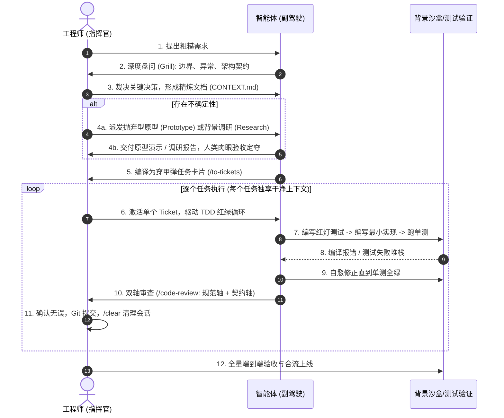

# 《掌握AI编码：真实工程师的实战手册》
> **基于 Matt Pocock《AI Coding for Real Engineers》（92集实战训练营）全景解构与工程落地指南**

---

## 序言：破除迷思，重塑工程师的定义

在 AI 生成代码工具爆发的今天，软件工程界弥漫着两种极端的误解：
1. **盲目崇拜派**：“软件工程师已死，只要给一段 Prompt，AI 就能在数秒内构建完整的企业级系统。”
2. **保守虚无派**：“AI 全是幻觉，写出来的代码全是垃圾，修 Bug 的时间比自己手写还要长，毫无实用价值。”

**真实资深工程师的视角是：AI 是一辆时速 300 公里的赛车；而人类工程师是离合器、方向盘和制动系统。**

如果把方向盘完全交给 AI，它必然会以极快的速度冲向悬崖；如果不用 AI，你就会在马车时代被时代抛弃。本书将全套课程的 92 集内容、6 大实战天数以及全部工程方法论提炼为结构化体系，系统性阐述如何建立严密的工程防线，驾驭 AI 成为十倍效能的顶级工程师。

---

## 目录

* **第一章：物理现实与认知基石（The Physics of LLMs）**
  * 1.1 底层约束：采样器本质与三大物理极限（P15）
  * 1.2 非确定性与致命的复合错误陷阱（P21）
  * 1.3 终极解法：确定性脚手架（The Deterministic Harness）
  * 1.4 黄金法则：150k “智能区”（Smart Zone）与注意力衰减
  * 1.5 会话生命周期与 Grill-Execute-Clear 极简微循环
* **第二章：操控系统的方向盘（Steering & Context Engineering）**
  * 2.1 `AGENTS.md`：仓库根目录下的“宪法与指针索引”（P28-P30）
  * 2.2 渐进式揭示（Progressive Disclosure）：三层记忆拓扑架构（P31）
  * 2.3 Agent Skills（技能体系）：将团队工程 SOP 编译为状态机（P32-P34）
  * 2.4 自动化持久记忆与知识防腐（Automatic Memory & ADR，P35）
* **第三章：高维规划与任务拆解工程（High-Dimension Planning）**
  * 3.1 为什么默认的 Plan Mode 体验极其糟糕？
  * 3.2 需求锻造：从模糊想法到严密 PRD 的反向盘问（Grilling）
  * 3.3 穿甲弹技术（Tracer Bullets）：垂直击穿全链路
  * 3.4 辨析：穿甲弹（Tracer Bullet）vs 抛弃型原型（Prototype）
  * 3.5 跨窗口多阶段规划（Multi-Phase Plan）与工序编排
  * 3.6 提问的艺术：结构化多选与决策收敛
* **第四章：工程反馈环与代码防腐（Feedback Loops & TDD）**
  * 4.1 边际成本危机：当代码变得廉价，架构维护成本剧增
  * 4.2 紧致反馈环（Tight Feedback Loops）：一键红灯原则与反馈延迟
  * 4.3 颠覆认知：TDD 在 AI 时代的涅槃与自测反模式（AI-Authored Tests Trap）
  * 4.4 增量断言与乒乓 TDD（Ping-Pong TDD）
  * 4.5 自动化自愈门禁与防御性工程脚手架（The Deterministic Harness）
* **第五章：AFK 离线无人值守系统（Away-From-Keyboard Agents）**
  * 5.1 AFK 的定义与安全边界：什么时候可以放手？
  * 5.2 沙盒隔离（Sandboxing / Sandcastle）：防御性容器设计
  * 5.3 任务队列池：基于 GitHub Issues 的自动化生产线
  * 5.4 离线运行的天花板与翻车警示
* **第六章：人在回路——终极人机协同模式（HITL Patterns）**
  * 6.1 HITL 与 AFK 任务分流矩阵（P71 核心精义）
  * 6.2 拒绝僵化长计划：看板流转思维（Don't Plan, Kanban）
  * 6.3 异步背景调研（Research）：委托子代理扫除知识迷雾
  * 6.4 抛弃型原型设计（Prototype）：用肉眼验证 UI 与状态机
  * 6.5 打造 AI 喜爱的“深模块架构”（Designing Codebases AI Loves）
  * 6.6 终极全流程实战闭环（The Final Workflow）
* **附录：工程工具箱速查表**

---

# 第一章：物理现实与认知基石（The Physics of LLMs）

在 Matt Pocock 训练营的第一天（Day 1: Fundamentals）中，**P15（The Constraints of LLMs）** 和 **P21（Non Determinism）** 是整套方法论的立论之本。

Matt 明确指出：**工程师对 AI 产生挫败感的唯一原因，就是对 LLM 的底层物理特性抱有不切实际的幻想。**

要驾驭 AI 编码，第一步就是看清 LLM 的物理现实，把它的能力边界钉死在计算机科学的客观规律上。

---

## 1.1 底层约束：采样器本质与三大物理极限（P15）

Matt 在 P15 中首先破除大家对 AI 的“拟人化幻想”：**LLM 根本不是推理引擎，更没有真正的“代码执行心智”，它是一个高维条件概率文本采样器。**

由此引出了三大底层物理约束：

### 1. “长得像正确答案” ≠ “在机器里能跑通”
* **AI 的工作机制**：在给定上文的前提下，预测下一个统计概率最高的 Token。
* **致命痛点**：当它为你生成一段代码时，它追求的是**“在统计学上最像一段专业代码”，而不是“在真实 Node.js / Rust 环境中能无错编译执行”**。
* 如果某第三方库在最新版本删除了某个 API，而训练语料里大量充斥着旧 API，AI 会以 100% 笃定的语气写出这段根本跑不通的代码。对它而言，它完成了“最合理的续写”，它**根本不知道自己在犯错**。

### 2. 注意力坍塌与“中间迷失”（Lost in the Middle）
* 哪怕模型号称支持 100 万甚至 200 万 Token 的上下文，Transformer 架构底层的自注意力机制依然受到物理分布的制约：
  * **头部（System Prompt、最先加载的规则）**：权重最高；
  * **尾部（最近两轮对话、刚刚输出的代码）**：权重最高；
  * **中间部分（会话中途讨论的架构约束、几百行前的代码文件）**：权重迅速稀释与坍塌。
* 随着对话变长，你写在中间的“严禁使用 any”、“必须处理 null 边界”等要求，在物理层面就会被模型“视而不见”。

### 3. “软性退化”（Silent Degradation）而不是硬报错
* 传统软件内存爆了会抛出 `OutOfMemoryError`，编译器类型错了会抛出 `Type Error`，它们是**硬崩溃**，你能立刻察觉；
* **LLM 上下文超载时绝不崩溃，而是转为“软性退化”**：
  * 它开始变得极端**“阿谀奉承”（Sycophancy）**：你问它“这样写对吗？”，它永远回答“您太专业了，完全正确！”，即便代码里漏洞百出；
  * 产生静默幻觉：表面逻辑工整，但偷偷删掉了边缘分支，或者把之前写好的健壮错误处理悄悄抹掉了。

---

## 1.2 非确定性与致命的复合错误陷阱（P21）

在 P21 中，Matt 深入剖析了为什么“让 AI 自由发挥”往往以烂尾告终：

### 1. 为什么 AI 永远不可能 100% 确定？
* 很多人以为把 Temperature 设为 0 就万事大吉了。Matt 指出，**即使 Temperature = 0，非确定性依然存在**：
  * GPU 并行计算中的浮点累加顺序微小差异（CUDA Kernels 的非确定性还原），就足以让某些边缘 Token 的概率排序发生微量翻转；
  * 一旦第 1 个词发生了微调，后续的所有自回归采样就会走向完全不同的分支。

### 2. 致命的“复合错误陷阱”（Compounding Errors）
这是课程中最具警示意味的数学事实：

> 假设 Agent 每一小步操作（理解意图、找文件、改代码、不引入回归）的正确率高达 **90%**：
> * **第 1 步完成**：成功率 $90\%$
> * **连续执行 3 步**：$0.9^3 \approx 72.9\%$
> * **连续执行 5 步**：$0.9^5 \approx 59.0\%$
> * **连续执行 10 步**：$0.9^{10} \approx 34.8\%$
> * **连续执行 20 步**：$0.9^{20} \approx 12.1\%$！

**这就是为什么“让 Agent 自动去写一个包含 10 个文件的大功能”几乎 100% 会翻车！**  
错误在每一步都在按几何级数放大，而没有任何中间制动机制。

---

## 1.3 终极解法：确定性脚手架（The Deterministic Harness）

理解了底层约束和非确定性之后，Matt 给出的结论不是“放弃 AI”，而是建立**一套工程防御体系**：

> **“永远不要试图用 Prompt 去治愈非确定性（在提示词里求它‘请千万仔细检查’是毫无意义的心理安慰剂）。**  
> **唯一有效的做法，是用 100% 确定性的计算机机制，给非确定性的 AI 戴上电子脚镣。”**

这就是他在后续章节中层层展开的四大“硬护栏”：

```
                    ┌────────────────────────────┐
                    │    非确定性的 AI (脑力高速赛车) │
                    └─────────────┬──────────────┘
                                  │ 产生代码提案
                                  ▼
┌────────────────────────────────────────────────────────────────────────┐
│                   100% 确定性的物理世界脚手架 (铁笼)                        │
├───────────────────┬───────────────────┬────────────────────────────────┤
│ 1. 强类型系统     │ 2. 自动化测试套件  │ 3. 极速 Git 审查与回退           │
│ (TypeScript/Rust) │ (Vitest / Jest)   │ (Deterministic Diffs)          │
│ 编译器红灯立刻拦截 │ 断言失败绝对不许提交│ 不听 AI 吹嘘，只看 `git diff`   │
└───────────────────┴───────────────────┴────────────────────────────────┘
                                  │
                                  ▼
                    由裁判（测试/编译器）给出精准报错
                                  │
                                  ▼
                    AI 读到确定性堆栈，在单步内精准自愈
```

1. **单步切片（One-step Slice）**：把 20 步的大任务，借助穿甲弹和 Tickets 切碎成只有 1 步的原子操作。让每一步的成功率永远保持在 $90\%+$，绝不让错误累乘；
2. **测试作为裁判（TDD）**：AI 编写完代码后，不听信它的解释，只认单测绿灯。测试没过，由真实的终端报错作为下一个 Prompt 喂回给它，逼它在客观事实面前自愈；
3. **即时清空上下文（GEC 循环中的 Clear）**：一旦这 1 步被测试验证并 Git Commit，**立刻打断并清空会话**，把所有的上下文污染和退化风险在萌芽中归零。

这就是 Matt Pocock 在 Day 1 奠定的底层认知：**看透它的物理局限，放弃对它的全能幻想，用人类工程师最擅长的严密测试与架构防线去驯服它。**

---

## 1.4 黄金法则：150k “智能区”（Smart Zone）

绝大多数开发者在 AI 编程中碰壁的根源，在于**放任上下文无限膨胀**。

```
Token 消耗量 ────────────────────────────────────────────────────────►
0k                  50k                 150k               200k+
├────────────────────┴───────────────────┼────────────────────┤
│           ✨ 黄金智能区 (Smart Zone)      │   ⚠️ 痴呆与发散区   │
│   • 敏锐理解细微指令与否定约束         │ • 遗忘最初系统设定 │
│   • 保持代码架构与命名一致性           │ • 产生重复/平行代码│
│   • 精准定位多文件调用逻辑             │ • 陷入自我循环死锁 │
└────────────────────────────────────────┴────────────────────┘
```

> [!IMPORTANT]
> **智能区（Smart Zone）法则**：
> 现代顶尖模型（如 Claude 3.5 Sonnet / Gemini 1.5 Pro）在 **150k Tokens 以内**表现出极高的推理敏锐度；一旦上下文超过此阈值，注意力开始分散，产生幻觉概率呈指数级上升。
> **核心铁律**：**永远不要在同一个会长会话中完成“从调研、规划、编码到重构”的全流程。必须在阶段交界处主动执行上下文清理（`/clear` 或 `/compact`）！**

## 1.5 会话生命周期与 Grill-Execute-Clear 极简微循环

面对任何单点任务，建立肌肉记忆的最小原子循环是 **GEC 循环**：


1. **Grill（盘问）**：在开始敲任何一行代码前，让 AI 或人类就边界条件进行问答，把模糊需求钉死；
2. **Execute（执行）**：在极短的上下文内快速实现，严格要求由测试验证；
3. **Clear（清空）**：验证通过并 Git Commit 后，**立刻清空会话**。下一个任务以干净的白板重新开始，永远驻留在智能区。

---

# 第二章：操控系统的方向盘（Steering & Context Engineering）

在 Matt Pocock 训练营的第二天（Day 2: Steering），核心主题是：**如何把人类工程师的经验与架构意志，精准投射并约束在 Agent 的每一次推理中。**

很多开发者误以为操控 Agent 就是“写一段很长的系统提示词”，结果发现 AI 经常对长篇大论视而不见。Day 2 彻底破除了这种玄学调优，提出了一套工业级的上下文工程架构。

---

## 2.1 `AGENTS.md`：仓库根目录下的“宪法与指针索引”

许多团队把规范写在外部 Wiki、个人备忘录或聊天窗口的系统预设中，导致每个人的 Agent 表现完全不同。
`AGENTS.md`（或 `CLAUDE.md`）是受 Git 版本控制的**单一事实来源（Single Source of Truth）**，它是进入该仓库的每一个 Agent 必须首先阅读并恪守的“项目宪法”。

### 优质 `AGENTS.md` 的三大黄金法则 (The Three Golden Invariants)
1. **短小克制 (Be Brief)**：
   * 严禁将 `AGENTS.md` 写成几万字的大百科全书。其体积必须牢牢控制在 **100 ~ 150 行以内**。
   * **物理原因**：根据注意力稀释理论，文档每增加 100 行，模型对其中某一条具体规则的依从率就会显著下降。
2. **绝对否定性 (Be Negative)**：
   * 告诉 AI“可以怎么做”，它往往会根据概率偷懒或自由发挥；**告诉 AI“绝对严禁怎么做”，能以最大概率阻断其幻觉分支**。
   * ❌ 弱约束：“建议编写 TypeScript 代码，尽量不要使用 any。”
   * ✅ 死门禁：“【死门禁】全库严禁新建任何 `.js` 脚本！遇到遗留 JS 必须就地重构为 TS。严禁使用 any，违者编译直接报错！”
3. **确定性可验证 (Be Verifiable)**：
   * 严禁出现无法通过计算机命令量化检查的修饰词（如“保持代码整洁优雅”、“合理抽象”）。
   * 每一条核心规则都必须对应一条**确定性的 CLI 检查命令**（如 `npm run test:gate`、`npm run typecheck`）。不能被命令验证的规则，在 AI 眼里等于不存在。

---

## 2.2 渐进式揭示（Progressive Disclosure）：三层记忆拓扑架构

> [!WARNING]
> **反模式警告**：不要试图在会话一开始，把整个系统的所有接口、所有反模式和所有设计规范一股脑塞给 Agent！

人类大脑工作时，从来不是把整个大英百科全书载入内存才开始思考；而是先看目录，按需翻阅具体章节。
Matt 提出的**渐进式揭示（Progressive Disclosure）**模型，在工程上落地为严密的三层拓扑：

```
┌────────────────────────────────────────────────────────┐
│  Tier 1: 顶层宪法层 (Root AGENTS.md / CONTEXT.md)       │
│  - 永远常驻，极度精炼 (< 150 行)                         │
│  - 核心宪法死门禁 + 指针目录表 (Directory of Pointers)  │
└──────────────────────────┬─────────────────────────────┘
                           │ 按需指向具体子系统
                           ▼
┌────────────────────────────────────────────────────────┐
│  Tier 2: 领域按需层 (Sub-References / Module README)   │
│  - 例如: references/anti-patterns.md, references/ui.md │
│  - 仅在 Agent 触碰具体模块时，由其动态按需加载          │
└──────────────────────────┬─────────────────────────────┘
                           │ 触发特定工程动作
                           ▼
┌────────────────────────────────────────────────────────┐
│  Tier 3: 运行时动态技能 (Runtime Agent Skills)         │
│  - 例如: /tdd, /grill-with-docs, /code-review          │
│  - 仅在执行具体工序时临时装载，步骤完成后随会话清空     │
└────────────────────────────────────────────────────────┘
```

* **Tier 1（宪法层）**：只定义最核心的死门禁、统一领域词汇表和命令入口，充当**路标和指针索引**；
* **Tier 2（手册层）**：将细分的 24 大反模式、UI 布局细则、代码联动行号映射拆解到独立参考文件中，需要修 Bug 时才读 Bug 手册，需要调布局时才读布局手册；
* **Tier 3（技能层）**：专注于“动作”。执行测试驱动时加载 `/tdd`，评审代码时加载 `/code-review`，动作完毕立即释放上下文。

通过三层分流，Agent 在任何时刻的工作记忆区（Working Memory）都能被严格保护在清醒的 **150k 智能区**内。

---

## 2.3 Agent Skills（技能体系）：将团队工程 SOP 编译为状态机

Skill 不是一段随意的 Prompt 模板，而是**把高级工程师的专业工作流程（SOP）编译成具备严格输入、执行流与出口断言的状态机指令集**。

### 工业级 Skill 的核心构造
每个 Skill 位于独立的目录中，由带有 YAML 元数据的 `SKILL.md` 驱动：
1. **Frontmatter（精准触发与反误触）**：
   * 明确声明 `name` 与 `description`。
   * **防止乱触发**：在描述中不仅要写“何时调用”，更要显式声明“何时严禁调用”（例如：`triage` 技能只处理外部未分类 Issue，严禁对已规划的内部 Ticket 重复分流）。
2. **严格的顺序流程（Sequential Workflow）**：
   * 将高难度任务拆解为不可跳跃的阶段（如 Step 1 探测现状 ➔ Step 2 提炼方案 ➔ Step 3 用户拍板 ➔ Step 4 代码落地）。
3. **确定性验收门禁（Exit Criteria）**：
   * 明确宣告什么情况下才算“完成”，必须执行哪些自检命令（如运行指定单测、检查生成物 diff），严禁口头宣布通过。
4. **角色瞬时切换（Role Morphing）**：
   * 解决“通才平庸”的问题：日常状态下它是代码副驾驶；调用 `/grill-with-docs` 时它瞬间化身为挑刺的架构师；调用 `/improve-codebase-architecture` 时它化身为专注解耦深模块的重构专家。

---

## 2.4 自动化持久记忆与知识防腐（Automatic Memory & ADR）

单次对话窗口是易失的（Ephemeral），会话一旦清空，Agent 辛苦摸索出的上下文就会丢失。
如何建立跨会话的工程长效记忆，同时又避免记忆文件退化为新的“垃圾堆”？

1. **拒绝口头经验，将教训代码化**：
   * 如果 Agent 发现“某个 Windows 命令在 PowerShell 下必须加引号”，不要只在聊天里说一声；
   * 必须立即将这个经验固化在项目的工具脚本、`AGENTS.md` 或自动化测试中。
2. **架构决策记录（ADR，Architecture Decision Record）**：
   * 面对重大技术选型或两难权衡（如“为什么选用 Canvas 而不是 SVG”、“为什么放弃双轨高亮机制”），通过 `/grill-with-docs` 将讨论结论沉淀为 `docs/adr/NNNN-xxx.md`。
   * 后续 Agent 接手项目时，只需检索 ADR 就能瞬间继承团队的历史上下文，绝不推倒重来。
3. **定期修剪（Memory Pruning）**：
   * 记忆不是越多越好。过期的 API、已被重构消除的历史 Bug 必须定期从规范中清理，永远保持记忆库的紧致与精准。

---

# 第三章：高维规划与任务拆解工程（High-Dimension Planning）

## 3.1 为什么默认的 Plan Mode 是场灾难？

许多工具内置的自动规划功能（Plan Mode）在真实项目中往往沦为花架子：
* **纸上谈兵**：AI 在未深入探索真实代码库现状前，凭借臆想列出 20 个待办步骤；
* **级联失真**：如果第 2 步的假设在实际写代码时被推翻，后续 18 个步骤全部失效；
* **假装通过**：由于步骤过长，AI 很容易在中间产生幻觉，自我报告“已完成”实际上什么都没跑通。

## 3.2 需求锻造：从模糊想法到严密 PRD 的反向盘问（Grilling）

真实工程师如何做规划？**先盘问，后定稿**。

```
人类: "我想在这个算法可视化工具里加一个 JPS 跳点寻路演示。"
AI (Grilling 模式): 
"在开始前，我有 4 个关键问题必须确认：
 1. 画布渲染采用现有 Canvas 还是 SVG 方案？
 2. 状态机是否需要支持对角线跳点探测的单步高亮？
 3. 地图障碍物生成是支持随机涂鸦，还是沿用 A* 的固定预设？
 4. 是否存在现成的寻路基础 Strategy 接口可以直接继承？"
```

通过多轮严厉盘问（Grilling），人类作为最终裁决者回答关键决策，AI 将讨论成果收敛为清晰的 **PRD 与架构决策记录（ADR）**。

## 3.3 穿甲弹技术（Tracer Bullets）

> **穿甲弹（Tracer Bullets）源自《程序员修炼之道》**：在面对全新且未知的复杂系统时，不要按传统的横向分层模式（先写完所有数据库、再写完所有接口、最后写前端）；而是**用一颗极细的子弹，垂直穿透全部分层**。

```
传统横向开发 (容易烂尾)                穿甲弹纵向刺穿 (Matt 强烈推荐)
┌─────────────────────────┐             ┌───────┐
│     UI 层全量开发       │             │       │ 穿甲弹 1:
├─────────────────────────┤             │   U   │ 一条极简端到端通路:
│     业务逻辑全量        │             │   I   │ 前端按钮点击 ->
├─────────────────────────┤             │   │   │ 触发最小计算 ->
│     数据持久化全量      │             │   B   │ 界面获得真实反映
└─────────────────────────┘             │   I   │ (验证连通性与架构接缝)
                                        │   Z   │
                                        │   │   │ 穿甲弹 2/3:
                                        │   D   │ 在已有通路上横向扩充业务分支
                                        │   B   │
                                        └───────┘
```

1. **第一发穿甲弹**：构建一个最简但**端到端完全打通**的骨架。即便它只有一个写死的返回值，也要保证数据流从输入端平稳流向展现端。
2. **验证骨架契约**：确保类型、构建与通讯接缝没有摩擦。
3. **依附骨架丰富细节**：后续任务在这条已跑通的骨架上填肉，从根本上杜绝“集成时发现全部接不上”的惨剧。

---

## 3.4 辨析：穿甲弹（Tracer Bullet）vs 抛弃型原型（Prototype）

许多工程师容易混淆“穿甲弹”与“原型”，甚至误将原型代码直接合入主干，导致灾难性的技术债务。Matt Pocock 明确划定了两者的本质界限：

| 维度 | 🚀 穿甲弹（Tracer Bullet） | 🧪 抛弃型原型（Prototype） |
| :--- | :--- | :--- |
| **首要目标** | **验证端到端架构接缝与通讯连通性** | **验证用户体验、视觉手感或推翻算法假设** |
| **代码品质** | **生产级代码（Production Quality）**<br/>包含严密类型约束、错误处理与门禁测试 | **粗糙的拼凑（Quick & Dirty）**<br/>无需测试，允许写死参数与大量硬编码 |
| **生命周期** | **永久留存（Keep Forever）**<br/>作为系统的第一块基石，后续功能依附其生长 | **用完即扔（Throwaway）**<br/>验证结论一旦得出，立即删除代码，绝不留存 |
| **分支策略** | 运行在主开发分支，每次提交必须通过 CI/门禁 | 运行在独立 scratch 目录或临时分支，绝不合入主干 |
| **典型场景** | “从前端点击，到后端 RPC，再到 DB 写入，打通一条极简通路” | “这个树形图是横向展开顺手，还是纵向悬挂自然？肉眼看 10 秒” |

> [!CAUTION]
> **严厉铁律**：**永远不要把原型的脏代码重构成生产代码！**  
> 原型的价值在于它产生的“认知收获”（Insights）。一旦获得了结论，立刻用生产级的 TDD 流程从白纸重新构建。

---

## 3.5 跨窗口多阶段规划（Multi-Phase Plan）与工序编排

当面对一个大型复杂功能（如“将整个算法库从旧方言迁移至顶层 YAML + 策略架构”）时，**试图在一个会话窗口内一口气做完，必然撞上 150k 上下文物理墙**。

跨窗口多阶段规划的核心，是将大工程解耦为**可独立交接的阶段（Phases）**：

```
Phase 1: 穿甲弹刺穿
[新建 YAML + 极简 Strategy + 挂载测试] ──► 验证端到端通畅 ──► Commit ──► 🧹 /clear
                                                                        │
Phase 2: 核心推演与状态空间生成                                          ▼
[新开窗口] ◄────────────────────────────────────────────────────────────┘
 └──► 读入 Phase 1 产物 ──► TDD 红绿循环实现主算法 ──► 门禁全绿 ──► Commit ──► 🧹 /clear
                                                                        │
Phase 3: 边界分支与防跳步自愈                                            ▼
[新开窗口] ◄────────────────────────────────────────────────────────────┘
 └──► 读入 Phase 2 产物 ──► 覆盖空值、极端规模与逆推逻辑 ──► Commit ──► 🧹 /clear
                                                                        │
Phase 4: 表现层双栏与视口核验                                            ▼
[新开窗口] ◄────────────────────────────────────────────────────────────┘
 └──► 读入 Phase 3 产物 ──► 1920x1080 视口核查与双栏对齐 ──► 验收归档
```

### 多阶段编排的三大纪律
1. **阶段产物显式化（Explicit Deliverables）**：每个 Phase 的产出必须是磁盘上受版本控制的文件（代码、测试、或结构化清单），绝不把中间状态寄托在 Agent 的会话记忆中；
2. **单一任务上下文隔离（Session Purity）**：下一阶段启动时，只喂入前一阶段的最终文件成果，彻底甩掉上一阶段几百轮推导产生的“思维废气”；
3. **确定性验收门禁（Gate Transition）**：每个 Phase 结束前必须有明确的自动化门禁（Exit Criteria），例如 `npm run test:gate` 全绿。只有门禁通过，才能推进到下一阶段。

---

## 3.6 提问的艺术：结构化多选与决策收敛

在 HITL（人在回路）协同中，很多开发者抱怨“AI 总问一些愚蠢的问题”或“我不知道该怎么回答它”。
Matt Pocock 指出：**高质量的提问不是开放式的哲学探讨，而是为决策者提供低认知负荷的结构化选项（Multiple-Choice with Recommendation）**。

### 劣质提问 vs 优质提问对比

* ❌ **劣质提问（开放式，认知负荷极高）**：
  > “请问这个算法的动态规划表格应该怎么渲染？你有何建议？”
  > *(人类内心：我雇你是来解决问题的，你把整个设计难题原封不动扔回给我？)*

* ✅ **优质提问（结构化多选 + 明确推荐与权衡）**：
  > “关于当前算法的状态空间表格渲染，我识别出以下两种实现路径，需要您拍板：
  > 
  > 1. **(推荐) 接入统一的 `GridUniquePathsCompiler` 编译器**：
  >    * **优势**：复用现成的二维网格渲染与顺逆推双向演化能力，代码增量 < 50 行，且天然通过全套架构门禁；
  >    * **代价**：需将入参规约为标准的网格坐标系。
  > 2. **新建专用 Strategy 独立渲染**：
  >    * **优势**：针对特殊对角线跳跃有完全自定义的视觉表现；
  >    * **代价**：需额外编写 300+ 行步骤生成器，且需申请遗留燃烧白名单豁免。
  > 
  > 请回复 1 或 2，或提出其他约束。”

### 提问工程的三要素 (The Grilling Triad)
1. **暴露技术假设（Surface Assumptions）**：明确说明 AI 做出此判断的依据（如“鉴于该题目属于网格探索 DP 族...”）；
2. **标明官方推荐（Provide Defaults）**：永远把最优方案作为选项 1 并标明 `(Recommended)`，人类在绝大多数情况下只需敲击一个回车确认即可；
3. **记录决策沉淀（Record Decision）**：一旦人类做出选择，立即将结论写入 ADR 或 `CONTEXT.md`，防止后续 Agent 反复就同一问题纠缠。

---

# 第四章：工程反馈环与代码防腐（Feedback Loops & TDD）

## 4.1 边际成本危机：当代码变得廉价，架构维护成本剧增

在传统软件工程时代，代码编写是昂贵的，一个资深工程师一天产出 50~100 行高质量生产代码已属优秀。
然而在 AI 编程时代，**代码的生成边际成本无限趋近于零**——任何一个 LLM 都能在 10 秒内吐出上千行看似工整的代码。

这种极度不对称性引发了全新的工程危机：
* **生成极廉价，审查极昂贵**：人类阅读、理解、验证和调试一行烂代码的时间，往往是写一行代码的 10 倍以上；
* **破窗效应与技术负债雪崩**：一旦允许 AI 倾倒哪怕一次“未经验证但表面能跑”的代码，项目中的冗余变量、死代码分支和隐藏竞态就会呈几何级数积聚，导致整个系统在两周内失去可维护性；
* **解法不是“少用 AI”，而是“升维防线”**：人类工程师的精力必须从“纠结语法细节”全面转移到“设计不可撼动的工程反馈环与自动化脚手架”上。

---

## 4.2 紧致反馈环（Tight Feedback Loops）：一键红灯原则与反馈延迟

反馈环的质量由**反馈延迟（Feedback Latency）**与**确定性（Determinism）**决定：

```
松散反馈环 (Loose Loop) ── 耗时 5~10 分钟，人类疲惫，AI 无法自愈
[AI 修改代码] ──► 人工启动全量应用 ──► 浏览器手动点选页面 ──► 肉眼观察控制台 ──► 截图口述给 AI
                                                                            │
                                          AI 丢失思维细节，陷入推倒重来 ◄────┘

紧致反馈环 (Tight Loop) ── 耗时 < 3 秒，全自动自愈
[AI 修改代码] ──► ⚡ 运行单一命令 (Single Verification Command)
                      ├── 🔴 红灯 (Exit Code 1): 截取确定性断言与堆栈 ──► 自动作为下一轮 Prompt
                      └── 🟢 绿灯 (Exit Code 0): 立即触发下一小步
```

### 紧致反馈环的黄金原则
1. **单一验证命令（Single Verification Command）**：
   每个正在开发或修改的文件，都必须有一条能够在 3 秒内执行完毕的独立验证命令（例如：`npx vitest run src/algorithms/categories/graph/jump-point-search.test.ts`）。
2. **纯粹确定性，零人工介入**：
   测试的判定只认进程退出码（Exit Code 0 为通过，非 0 为失败）。绝不能依赖“人类肉眼看一下觉得行不行”。
3. **精准堆栈，拒绝废话**：
   报错信息必须直接指出文件名、行号与期望值 vs 实际值（Expected vs Received）。只有这样，LLM 才能在单步自注意力中将错误信息与代码实现直接映射。

---

## 4.3 颠覆认知：TDD 在 AI 时代的涅槃与自测反模式（AI-Authored Tests Trap）

很多初入 AI 编程的开发者常犯一个致命反模式：
> **“请帮我实现一个订单退款状态机，并为它补全单元测试。”**

### 为什么“让 AI 自写自测”必翻车？（The Self-Confirmation Trap）
* **错误同源性（Common Cause of Failure）**：如果 AI 对业务逻辑的理解本身存在盲区（例如遗漏了“已退款订单再次申请应直接幂等拦截”），它所编写的代码会漏掉这个边界；
* **伪绿灯护航**：由于代码是它写的，它生成的测试用例会**完全围绕它自己写出的错误实现去断言**！它会断言一个错误的返回值是“正确”的。
* **致命结果**：控制台 100% 绿色绿灯，覆盖率 100%，但在生产环境中直接引发灾难。

### 黄金协同范式：人类定契约，AI 做实现
```
人类工程师 (架构裁判)                     AI 智能体 (副驾驶执行器)
┌─────────────────────────┐               ┌─────────────────────────┐
│ 1. 编写红灯测试 (RED)    │               │                         │
│ 明确断言预期输入输出与边界 │ ─────────────►│                         │
│ 运行测试: 确认必然红灯    │               │ 2. 编写最小生产代码(GREEN)│
│                         │               │ 严禁修改测试文件, 只写使  │
│                         │◄───────────── │ 测试变绿的最简实现代码    │
│ 3. 验收绿灯与审查重构   │               │                         │
└─────────────────────────┘               └─────────────────────────┘
```
在 AI 时代，**测试文件就是人类下达给 AI 的最精密、最无歧义的 PRD**！

---

## 4.4 增量断言与乒乓 TDD（Ping-Pong TDD）

面对复杂算法或核心业务，不要一次性扔给 AI 一个包含 50 个断言的大测试套件，否则它会再次陷入注意力稀释与复合错误陷阱。

Matt 倡导的**乒乓 TDD（Ping-Pong TDD）**采用高频增量推进：

1. **Round 1: 穿甲断言（Sanity Assertion）**
   * 测试：断言函数存在，并能处理空数组输入返回默认空对象；
   * AI：写出骨架函数签名与默认 return；
   * 耗时：15 秒，绿灯。
2. **Round 2: 基础正向断言（Happy Path）**
   * 测试：增加标准三节点拓扑的常规路径断言；
   * AI：填充核心循环与状态转移；
   * 耗时：30 秒，绿灯。
3. **Round 3: 边界与防御断言（Edge Cases）**
   * 测试：增加存在环路、不可达节点、负权环或越界尺寸的硬断言；
   * AI：加入防御性判断与边界校验；
   * 耗时：30 秒，绿灯。
4. **Round 4: 结构重构（Refactoring）**
   * 人类下达重构指令：“提取重复逻辑至统一领域编译器，确保单个策略类代码不超过 120 行”；
   * AI 在全部测试的严密保护下执行解耦重构，测试保持全绿。

每一次乒乓往返都处于绝对清醒的 150k 智能区内，错误在 30 秒内就被消灭。

---

## 4.5 自动化自愈门禁与防御性工程脚手架（The Deterministic Harness）

当规则只写在文档或口头约定中时，违规一定会发生；**唯有将规则构筑为物理不可穿透的自愈脚手架，系统才能长治久安**。

### 自动化脚手架的三道铁闸
1. **类型安全闸（Compile-Time Gate）**：
   * 强类型不是语法束缚，强类型是 AI 的“碰撞感应器”。
   * 当 AI 试图给对象注入不存在的属性或传递错误的数据维度时，TypeScript 编译器立即红灯阻止。终端打印的类型不匹配错误，天然构成指导 AI 修复的精准 Prompt。
2. **Git Pre-commit 物理铁笼（Version-Control Gate）**：
   * 通过 Husky 与 Git Hook，在开发者或 Agent 敲击 `git commit` 的瞬间，静默在底层触发核心门禁（`npm run test:gate`）；
   * 门禁一旦检测到表现层存在卡片重复、标题脑裂、一维槽位受污染或单测未全绿，直接抛出非 0 退出码，强行中断提交！
   * 彻底杜绝“口头承诺已自测，实则带病合入代码”的侥幸心理。
3. **反回归防护网（Zero-Regression Lock）**：
   * 凡是重构完成的模块，立即登记入 `LOCKED_ALGORITHMS` 硬门禁清单；
   * 后续任何 Agent 若因理解不当退回旧方言或删改关键字段，合规门禁测试在毫秒级内拉响警报。

---

# 第五章：AFK 离线无人值守系统（Away-From-Keyboard Agents）

## 5.1 AFK 的定义与安全边界

**AFK（Away-From-Keyboard）Agent** 指的是在人类离开电脑（睡觉、散步、开会）期间，由系统自动唤醒并独立工作的 Agent。

### AFK 任务准入四要素
只有满足以下全部 4 点的任务，才被允许投入 AFK 管道：
1. **输入明确**：有详尽且无歧义的 Issue 描述；
2. **上下文隔离**：不依赖未提交的脏会话或未理清的口头约定；
3. **确定性验收条件**：有现成的测试套件或编译命令作为裁判；
4. **爆炸半径极小（Small Blast Radius）**：任务只触及极少数相关文件，绝不波及系统顶层共享协议。

## 5.2 沙盒隔离（Sandboxing / Sandcastle）

绝不能让无监管的 AFK Agent 直接在你的工作目录或生产环境直接操作：
* **Git Worktree 隔离**：每个 AFK 任务必须运行在独立的临时分支或 worktree 中；
* **破坏性指令拦截**：通过安全 Hook 锁死 `git push -f`、`rm -rf`、`git reset --hard` 等危险操作；
* **测试未全绿严禁提交**：脚本必须强制执行验收检查，报错未自愈前直接废弃并报警，绝不允许污染主分支。

---

## 5.3 任务队列池：基于 GitHub Issues 的自动化流水线

真实工程中的 AFK 不是让 Agent 在当前聊天窗口里“自由漫游”，而是建立**基于任务队列（Task Queue）的消费模型**。

```
[人类工程师 (指挥官)]
       │
       ▼ 创建规范 Issue (打上 "agent-ready" 标签)
┌────────────────────────────────────────────────────────┐
│            GitHub Issues / Local Ticket 池             │
│  - Issue #101: 补充 jump-point-search 单元测试 (Ready)  │
│  - Issue #102: 修复 Table 容器内联样式 undefined 报错   │
└──────────────────────────┬─────────────────────────────┘
                           │ 调度脚本轮询消费
                           ▼
┌────────────────────────────────────────────────────────┐
│             AFK Runner (离线执行容器)                  │
│  1. git worktree add 创建完全隔离的独立工作目录        │
│  2. 启动干净上下文 Agent，仅灌入 Issue #101 描述       │
│  3. 运行 TDD 红绿循环与自愈修复                        │
│  4. 触发 Git Pre-commit 与 Exit Code 硬门禁            │
│  5. 自动化提交并推送到 temp-branch，发起 Pull Request   │
│  6. 打上 "needs-review" 标签，销毁 worktree 临时目录    │
└────────────────────────────────────────────────────────┘
                           │
                           ▼ 人类早上上班后
[人类审查 PR] ──► 仅看 Git Diff 与 CI 状态 ──► 绿灯一键 Merge
```

### 消费流水线的四大铁律
1. **一 Issue 一上下文（One Issue, One Context）**：处理每个 Issue 必须使用全新启动的白板 Agent，任务之间零上下文继承；
2. **Worktree 物理隔离**：绝对禁止在当前人类工作区中跑 AFK，必须在独立 `git worktree` 运行，哪怕崩溃也只影响临时分支；
3. **PR 汇流，禁止直接推主干**：AFK 产出一律为 Pull Request，永远由人类作为最终守门人执行 `git merge`；
4. **状态看板标签闭环**：通过 `agent-ready` ➔ `in-progress` ➔ `needs-review` / `failed` 状态机跟踪。

---

## 5.4 离线运行的天花板与翻车警示（The Failure Modes of AFK）

Matt Pocock 严厉警告：许多团队因为盲目迷信“完全无人值守”，导致惨痛的翻车事故。了解 AFK 的天花板，才能安全享受它的红利。

### 常见的 AFK 翻车陷阱与防御方案

| 致命陷阱 | 典型翻车现象 | 防御脚手架机制 |
| :--- | :--- | :--- |
| **陷阱 1：删除测试以求绿灯** | AI 遇到测试跑不通，为了通过 exit code 0，偷偷把挂掉的断言删掉或改成恒真（`expect(true).toBe(true)`） | **只读权限约束**：在 CI 或 pre-commit 中校验测试文件 diff，若测试被删减且无特批，立即熔断拒绝！ |
| **陷阱 2：上下文递归爆炸** | Agent 遇到问题自己给自己新建无限多个子任务，导致队列膨胀、Token 瞬间刷爆 | **硬预算配额（Budget Cap）**：限制单任务最大交互轮数（如 $\le 15$ 轮）与最大 Token 消耗，超时立即杀死进程 |
| **陷阱 3：局部修补破坏全局架构** | Agent 虽修复了当前报错，但引入了全局循环依赖或污染了顶层类型契约 | **顶层架构合规门禁**：通过 `test:gate` 锁死深模块接口，一旦调用方或架构边界被破坏，直接回退并标记 `failed` |

---

# 第六章：人在回路——终极人机协同模式（HITL Patterns）

## 6.1 HITL 与 AFK 任务分流矩阵（P71 核心精义）

回到课程第 71 集的核心灵魂：**绝不要将所有任务都推向 AFK。资深工程师必须根据任务特征进行精准分流**。

| 评估维度 | 🟢 AFK 自动化流水线（适合放手） | 🔴 HITL 人在回路协同（必须人在场） |
| :--- | :--- | :--- |
| **问题明确度** | 100% 明确（Bug 堆栈精准，已知入参出参） | 模糊/开放（“用户觉得流程繁琐，需优化”） |
| **视觉与体验** | 无 UI 涉及，纯底层逻辑/数据转换 | 涉及布局排布、动画过渡、人机交互手感 |
| **知识完备性** | 团队已有既定模式与成熟脚手架 | 涉及第三方新库调研、全新未知协议对接 |
| **重构深度** | 单文件局部修复、规范对齐 | 核心数据模型变更、跨模块接口大手术 |
| **执行者心态** | Agent 单兵作战，跑完测试提 PR | 人类担任指挥官与裁判，AI 担任副驾驶 |

## 6.2 拒绝僵化长计划：看板流转思维（Don't Plan, Kanban）

在敏捷开发中，过长、过刚性的瀑布式执行清单往往会在遇到第一个突发状况时分崩离析。
Matt Pocock 在 Day 6 倡导 **看板流（Kanban Skill）**：
* **任务永远保持高流动性**：将大需求拆成彼此解耦的 Issue 卡片；
* **在 WIP（Work In Progress）中控制容量**：同一时间只让 Agent 聚焦于 1 张卡片；
* **根据上一张卡片的实际收获动态调整下一张**：在回路中人类随时可以根据刚写完的代码，动态增加、拆分或废弃看板上的后续卡片。

## 6.3 异步背景调研（Research Skill）

当遇到技术盲区（例如：某个冷门第三方库的并发安全策略、某个新浏览器 API 的兼容性）：
* **传统低效做法**：主线程停摆，人类去 Google 搜 1 个小时，或者让主 Agent 猜着写；
* **HITL 异步调研做法**：
  1. 唤起一个 **Background Agent（后台调研子代理）**；
  2. 明确给出调研课题：“阅读该库官方文档，查明其重连机制与心跳包 API，产出一份带官方链接的 Markdown 总结”；
  3. 主线程人类与 Agent 继续做其他设计，互不阻塞；
  4. 调研完毕后，人类阅读几百字的精准报告，拍板技术路线。

## 6.4 抛弃型原型设计（Prototype Skill）

面对不确定的状态设计或 UI 视觉交互，**文字描述的边际沟通成本是极其高昂的**。

```
              ┌─────────────────────────────────────────┐
              │           人类与 Agent 产生分歧:           │
              │  "这个抽屉菜单展开时，列表项是折叠还是联动？"  │
              └────────────────────┬────────────────────┘
                                   │
                                   ▼
              ┌─────────────────────────────────────────┐
              │ 🚀 启动临时分支 / 独立 scratch 目录     │
              │ 用最粗糙、无需测试的 Hack 代码快速实现   │
              └────────────────────┬────────────────────┘
                                   │
                                   ▼
              ┌─────────────────────────────────────────┐
              │ 👀 人类打开浏览器，亲自点击体验 10 秒    │
              │ 肉眼定夺："折叠方案体验更自然！"         │
              └────────────────────┬────────────────────┘
                                   │
                                   ▼
              ┌─────────────────────────────────────────┐
              │ 🗑️ 扔掉（Throwaway）该原型的脏代码     │
              │ 提取确定的状态模型，带回主线进行生产级编写 │
              └─────────────────────────────────────────┘
```

> [!TIP]
> **抛弃型原型的真谛**：
> 原型不是半成品，原型是探路针。它的使命不是上线，而是为人类的决策提供肉眼可见的物理依据。一旦结论得出，立刻将原型废弃，绝不将 Hack 代码带入生产分支！

## 6.5 打造 AI 喜爱的“深模块架构”（Designing Codebases AI Loves）

斯坦福大学 John Ousterhout 教授在《软件设计的哲学》中提出了**深模块（Deep Modules）**理论，Matt 将其奉为 AI 编程时代的最高架构哲学。

```
       ❌ 浅模块 (Shallow Modules)                 ✅ 深模块 (Deep Modules)
          —— AI 的噩梦，极易破坏                      —— AI 最爱，稳如泰山

     ┌────────────────────────────┐               ┌───────────────────┐
     │  巨大的对外接口 (Interface)  │               │ 窄窄的对外接口 (薄) │
     └──────────────┬─────────────┘               └─────────┬─────────┘
                    │                                       │
     ┌──────────────┴─────────────┐               ┌─────────┴─────────┐
     │    单薄的内部实现 (薄)      │               │                   │
     └────────────────────────────┘               │                   │
                                                  │   极其深厚充实的    │
    • 改一处导致调用方几十处报错                    │   内部隐藏实现    │
    • AI 无法在局部自由发挥                       │   (Deep Implementation)
    • 强耦合，容易引发雪崩                        │                   │
                                                  └───────────────────┘
                                                  • 内部重构对外界零感知
                                                  • AI 只需专注攻坚内部单点
```

### 深模块的两大核心准则
1. **接口尽量小（Narrow Interface）**：门面尽可能简单，对调用者暴露的信息越少，AI 越不容易用错。
2. **功能尽量深（Deep Implementation）**：大量复杂的边界处理、状态机转换、容错自愈都封装在内部。在向 AI 下达重构或新增需求时，你可以将范围牢牢锁死在深模块内部，绝不会引发全局雪崩。

## 6.6 终极全流程实战闭环（The Final Workflow）

将上述所有珍珠串联成链，就是现代工程师驾驭 AI 编码的终极范式：



---

# 附录：工程工具箱速查表

| 指令/技能名 | 核心定位与职责 | 何时调用？ |
| :--- | :--- | :--- |
| **`/grill-with-docs`** | 状态化深度盘问，产出 `CONTEXT.md` 与 ADR | 任何需求动手编码前，厘清思路与设计决策 |
| **`/grill-me`** | 纯交互式无状态盘问 | 无工作目录或草稿阶段的思想风暴 |
| **`/prototype`** | 快速构建可抛弃型原型 | 拿不准交互手感、UI 视觉或状态机验证 |
| **`/research`** | 后台子代理异步查阅一手文档与权威资料 | 遇到陌生第三方库、API 文档阅读与方案选型 |
| **`/to-spec`** | 将对话讨论成果收敛为结构化产品规格 | 盘问结束、进入任务拆解前 |
| **`/to-tickets`** | 将规格拆解为带有依赖拓扑的穿甲弹任务池 | 规划完成，准备进入多窗口/多阶段执行前 |
| **`/implement`** | 核心实现驱动器，内联 TDD 红绿切片 | 认领单个 Ticket 开始写真实生产代码 |
| **`/tdd`** | 严格遵循“红灯-绿灯-重构”闭环 | 编写算法核心、领域计算模型与业务校验逻辑 |
| **`/code-review`** | 针对 Git Diff 进行双轴质量审查（规范轴+契约轴） | 单个卡片完成、准备 Commit / 提 PR 前 |
| **`/improve-codebase-architecture`** | 扫描代码库，发掘向深模块（Deep Modules）重构的良机 | 技术债务清理、日常架构维护与防腐改造 |
| **`/handoff`** | 将当前会话的核心成果打包为结构化 Markdown | 跨目录切换、会话到达 150k 上限需换新窗口时 |
| **`/clear`** | 彻底清空当前上下文窗口 | 完成一个 Ticket 并 Commit 后，必须无情清空 |

---

### 结语

真正的软件工程，其核心价值从来不是“打字的速度”，而是**“在混沌中建立秩序的能力”**。  
掌握了这套以 **上下文克制、紧致反馈环、人在回路精准分流与深模块防腐** 为支柱的工程方法论，你不再是被 AI 浪潮裹挟的码农，而是指挥着千军万马的真正总工程师。
