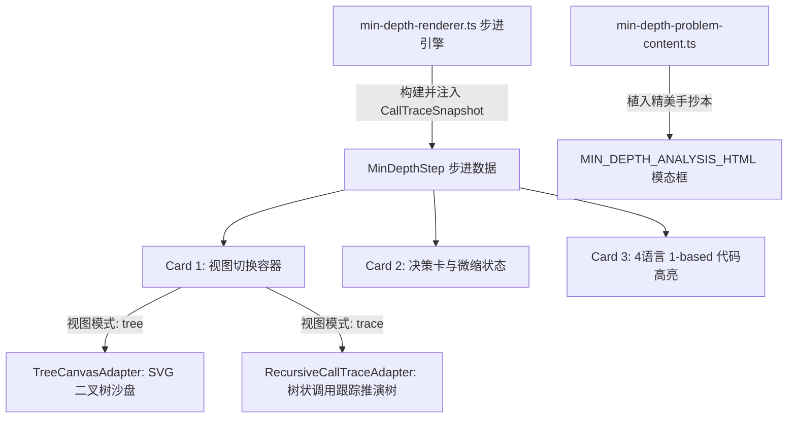

# 递归调用跟踪树 (Recursive Call Trace) 深度融合设计规范

## 1. 概述与需求背景
在树形算法（如二叉树深度、路径求和、最近公共祖先）与各类分治/回溯算法的教学中，传统的二维/三维节点拓扑图虽然能直观展示树的形态，但在解释**函数调用栈在时间维度上的深入与回溯**、以及**函数体内多分支条件的逐行判定逻辑**时，学习者往往难以建立心智模型。

用户提供的「树状递归调用跟踪与推演（Recursive Call Trace）」形式，通过具有层次缩进的树状分支线（`|---`）、行内条件判定序号（`①`~`⑤`）、条件命中与跳过标记（`√ 命中!` / `跳过`）、以及返回归约计算公式（`回到 minDepth(1): return Math.min(2, 1) + 1 = 2`），提供了无与伦比的递归展开全景视角。

本设计旨在：
1. **提炼通用递归追踪器深度模块**：`RecursiveCallTraceAdapter`，抽象通用的树状递归事件生命周期模型，可复用于全库递归与分治算法；
2. **在 LeetCode 111 (二叉树最小深度) 打造标杆级双向融合**：
   - **交互演示融合**：在 Stage 1 后序递归演化中，支持在 Card 1 沙盘区无缝切换「🌲 二叉树拓扑」与「📜 递归推演树」双重视角，并随步进高亮当前判定行与回溯归约；
   - **题目讲义融合**：在「📋 题目」的深度剖析中，完整植入高保真排版的经典推演手抄本。

---

## 2. 领域模型与核心数据结构

### 2.1 递归调用跟踪数据契约 (`RecursiveCallTraceTypes`)
在 `src/core/renderers/adapters/recursive-call-trace-adapter.ts` 中定义通用的递归跟踪抽象：

```typescript
export type CallTraceLineKind =
  | 'header'          // minDepth(1) <- 最终要算这个
  | 'condition-pass'  // ① root=1, 非空
  | 'condition-skip'  // ③ left != null (是2), 跳过
  | 'condition-hit'   // ③ root.left == null √ 命中!
  | 'recurse-prep'    // ⑤ 走最后一行: Math.min(minDepth(左), minDepth(右)) + 1
  | 'return-leaf'     // |--- 返回 1 ---
  | 'unwind-calc'     // 回到 minDepth(2): return 1 + 1 = 2
  | 'final-result';   // 最终返回 2

export interface CallTraceLine {
  id: string;                    // 唯一行 ID，如 "node-1-step-3"
  depth: number;                 // 树状缩进层级 (0, 1, 2...)
  text: string;                  // 行主体内容
  kind: CallTraceLineKind;       // 行语义分类
  comment?: string;              // 侧边注释（如 "<- 先算左边"、"<- 最终要算这个"）
  formula?: string;              // 计算式（如 "1 + 1 = 2"）
  status?: 'active' | 'done' | 'pending'; // 当前步的高亮状态
}

export interface CallTraceSnapshot {
  lines: CallTraceLine[];
  activeLineId?: string;         // 当前正在执行的高亮行 ID
  finalResult?: number | string; // 最终返回值
}
```

---

## 3. 模块架构与职责划分



### 3.1 深度适配器：`RecursiveCallTraceAdapter`
- **定位**：纯 TS / DOM 深度渲染模块，位于 `src/core/renderers/adapters/recursive-call-trace-adapter.ts`。
- **职责**：
  1. `render(container: HTMLElement, snapshot: CallTraceSnapshot, options?: RenderOptions): void`；
  2. 根据 `lines` 中的 `depth` 自动生成树枝竖线（`│`、`├──`、`└──`）；
  3. 为 `active` 行添加醒目的微光高亮背景条与光标指示，并平滑滚动到视野内；
  4. 采用现代暗黑等宽终端风格（`JetBrains Mono`），支持语义色彩：
     - 绿色：命中叶子与最终返回（`#10b981` / `text-emerald-400`）；
     - 蓝色/青色：函数入口与向下递归调用（`#38bdf8` / `text-sky-400`）；
     - 琥珀色/黄色：中间条件判定与分支跳过（`#f59e0b` / `text-amber-400`）；
     - 灰色：结构树干与侧边注释（`#64748b` / `text-slate-400`）。

### 3.2 步进引擎升级：`min-depth-renderer.ts`
- **生命周期跟踪**：在 `buildMinDepthStage1Steps(root)` 中维护一个 `CallTraceTracker`：
  - 进入函数时：追加 `header` 与注释；
  - 检查 `root == null` 时：追加判空条件行；
  - 检查叶节点时：追加 `!node.left && !node.right` 判叶行；
  - 遇到单侧为空时：追加单侧避坑与递归右/左调用行；
  - 左右均非空时：分步追加深入左子树、返回暂存、深入右子树、以及后序 `Math.min(l, r) + 1` 归约计算行；
  - 返回时：追加 `回到 minDepth(...)` 与返回值行。
- **预设用例扩展**：
  - 增加预设案例：`label: '截图推演用例: 四节点偏斜树 [1, 2, 3, null, 4]'`，`values: { 'input-tree': '1, 2, 3, null, 4' }`，使得运行该预设时，动态推演与用户截图 100% 严丝合缝。
- **Card 1 视图切换器**：
  - 在 Stage 1 下，沙盘区顶部提供视图切换按钮组：
    - `🌲 二叉树拓扑`
    - `📜 递归推演树`
  - 记忆用户所选视图（或默认保持交互响应），即使在推演树视图下，拖动播放条或点击步进也能毫秒级流式响应。

### 3.3 题目讲义升级：`min-depth-problem-content.ts`
- 在 `MIN_DEPTH_ANALYSIS_HTML` 中新增专门排版的 **“经典用例树形执行跟踪图解（手抄本）”**：
  - 使用等宽代码容器 `<pre style="...">`，将用户截图中的完整流程以高保真排版呈现；
  - 配备对每一阶段（深入、单侧避坑、叶子命中、后序归约）的理论剖析。

---

## 4. 边界处理与容错机制 (Edge Cases & Safety)

1. **空树或极小树**：
   - 当 `root == null` 时，推演树仅展示一行 `minDepth(null) -> 树为空 -> return 0`，不产生多余分支线；
   - 单节点根树 `[10]`：直接展示根节点判叶命中并返回 1。
2. **超大/深层二叉树**：
   - 若深度较大，推演树容器支持垂直与水平平滑滚动，并设置 `max-height: 100%`，防止破坏 4-Card 页面布局。
3. **架构合规与 DOM 纯净性**：
   - 遵从 `sanitizeSandboxDom` 契约，切换视图不引入多余的外部标题或嵌套卡片，彻底避免卡片套娃与重复镜像。

---

## 5. 验证与门禁标准 (Verification & Testing)

1. **单元测试与不变性保护**：
   - 新建 `src/core/renderers/adapters/recursive-call-trace-adapter.test.ts`，覆盖空快照、单行高亮、多级缩进连线、状态变更等生命周期；
   - 运行既有门禁：`npx vitest run src/core/strategies/tree-classic-stage-invariants.gate.test.ts`，确保 `minDepth` 所有阶段步进契约与行号绑定零退化。
2. **顶层抽象与表现层契约门禁**：
   - 运行 `npm run test:presentation`，确保满足 14 大红灯陷阱要求；
3. **元数据与全库类型检查**：
   - 运行 `npm run meta:sync`；
   - 运行 `npm run typecheck`。
